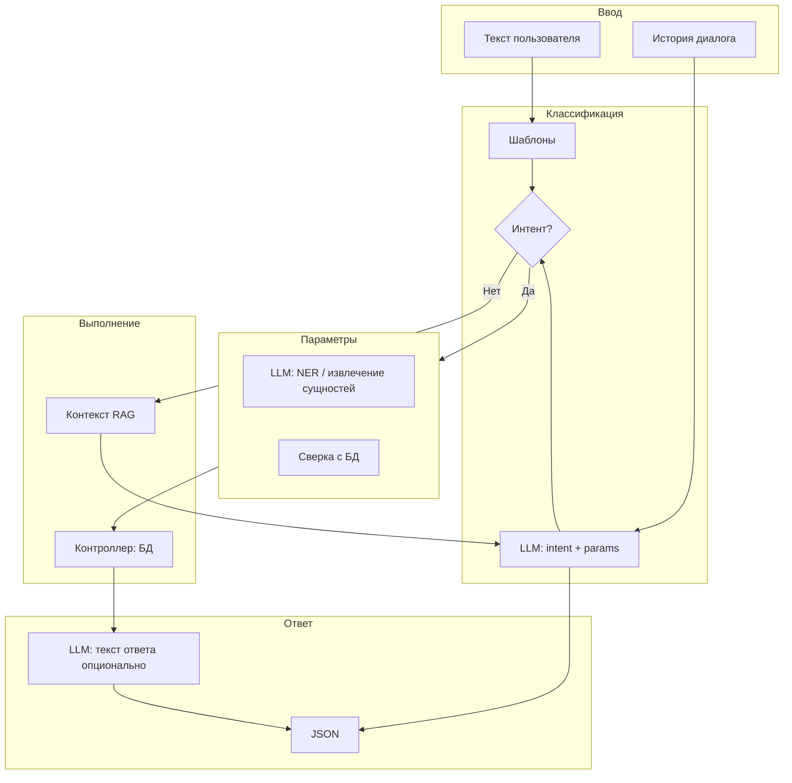

# Процесс работы помощника и варианты использования LLM

Документ описывает полный процесс обработки запроса в ИИ-помощнике, текущее и возможное участие LLM на каждом этапе, а также варианты реализации «полноценного» помощника с опорой на модель. Интенты и их перечень см. в [ИНТЕНТЫ_ПОМОЩНИКА_И_LLM.md](ИНТЕНТЫ_ПОМОЩНИКА_И_LLM.md).

---

## 1. Текущий процесс (как есть)

### 1.1. Общая схема

```
Пользователь вводит текст
        ↓
[Normalize] обрезка пробелов, нижний регистр
        ↓
[AssistantIntentParser::parse] проверка шаблонов и ключевых слов по фиксированному порядку
        ↓
   intent определён? ─── Да ──→ [AssistantController] построение ответа по интенту (БД, TasksSearch, Equipment, Location, Users)
   │                                    ↓
   │                            JSON: interpretation, data, link, hints
   │                                    ↓
   No                                 Ответ пользователю
   ↓
   [Опционально: LlmClient::completion] один запрос к LLM с системным промтом (направления + имя пользователя)
   ↓
   Ответ LLM подставляется в interpretation; hints — статический список подсказок
   ↓
   JSON: interpretation (от LLM или дефолт), hints, data=[], link=null
   ↓
   Ответ пользователю
```

**Ограничения текущего подхода:**

- LLM вызывается **только при неопределённом интенте** и только для генерации текста подсказки.
- Нет диалоговой истории — каждый запрос обрабатывается изолированно.
- Нет доступа модели к данным системы (списки пользователей, локаций, заявок) — только описание направлений в системном промте.
- Все «умные» решения (какой интент, какие параметры) принимаются только по шаблонам; формулировки вне шаблонов не распознаются.

---

## 2. Места участия LLM в процессе

Ниже перечислены **точки**, в которых LLM может участвовать в обработке запроса. Реализация может задействовать одну или несколько точек в зависимости от выбранного варианта.

| № | Точка | Что делает LLM | Когда вызывается | Текущая реализация |
|---|--------|-----------------|------------------|---------------------|
| 1 | **Классификация интента** | По тексту запроса возвращает идентификатор интента и (опционально) параметры в структурированном виде (JSON). | До или вместо проверки шаблонов; при `intent === null` после шаблонов. | Нет |
| 2 | **Извлечение сущностей (NER)** | Извлекает из запроса ФИО, номер кабинета, дату, инв. номер и т.д. для подстановки в params выбранного интента. | После определения интента, если у интента есть параметры и шаблон их не извлёк. | Нет |
| 3 | **Контекст из БД (RAG)** | Модель получает краткий срез данных (список ФИО, локаций, последние заявки) и использует их для ответа или уточнения. | При формировании системного/пользовательского сообщения перед вызовом LLM. | Да: текстовый срез (AssistantContextBuilder); опционально векторный поиск (ChromaDB). |
| 4 | **Диалоговая история** | В запрос к API передаётся массив предыдущих пар user/assistant, чтобы модель учитывала контекст («Покажи технику» → «Чью?» → «Печерского»). | При любом вызове LLM (fallback, классификация, генерация текста). | Нет |
| 5 | **Генерация текста при неопределённом запросе (fallback)** | Генерирует вежливый ответ с подсказками, когда шаблоны не сработали. | При `intent === null`. | Да (LlmClient::completion) |
| 6 | **Генерация формулировок ответа** | Формирует текст interpretation или подсказок после выполнения интента (например, «Показаны 12 заявок за последний месяц»). | После построения data по интенту; опционально. | Нет |

---

## 3. Полный целевой процесс с максимальным использованием LLM

Ниже описан **целевой** процесс, в котором LLM задействована во всех перечисленных точках. Это не обязательная конфигурация — варианты реализации (раздел 4) выбирают подмножество шагов.

### 3.1. Последовательность шагов

1. **Нормализация ввода**  
   Обрезка пробелов, приведение к нижнему регистру (как сейчас).

2. **Загрузка контекста для диалога**  
   Из сессии (или БД) читается история последних N пар «запрос — ответ» (например, 5–10 реплик). Если включена опция «история».

3. **Первичная классификация**  
   - Вариант A: только шаблоны (текущее поведение).  
   - Вариант B: сначала шаблоны; при `intent === null` — вызов LLM с промптом «верни JSON: intent, params» и разбор ответа.  
   - Вариант C: сразу вызов LLM для классификации с передачей списка интентов и примеров; шаблоны как fallback при сбое/недоверии к JSON.

4. **Извлечение параметров (если нужно)**  
   Если интент требует параметров (ФИО, локация, дата и т.д.) и они не получены из шаблона или из ответа классификатора: вызов LLM с промптом «извлеки из запроса сущности в JSON» и подстановка в `params`. Опционально сверка со справочниками (Users, Location) и уточняющий вопрос при неоднозначности.

5. **Подготовка контекста RAG (опционально)**  
   В зависимости от интента или при неопределённости: выборка из БД (топ пользователей по ФИО, список локаций, сводка по заявкам текущего пользователя). Формирование текстового блока для вставки в системное или пользовательское сообщение.

6. **Выполнение интента**  
   Если интент определён и параметры готовы — контроллер выполняет выборку (TasksSearch, Equipment, Location, Users) и формирует `data`, `link`, `summary`.

7. **Генерация текста ответа (опционально)**  
   После выполнения интента можно вызвать LLM с контекстом «выполнен запрос X, результат: N записей» для генерации короткой интерпретации. Либо использовать шаблонные фразы (как сейчас).

8. **Обработка неопределённого запроса**  
   Если после шагов 3–4 интент так и не определён: вызов LLM с системным промтом (направления + примеры), при необходимости — с RAG-контекстом и историей диалога. Ответ модели → `interpretation`; статичные `hints` — по желанию оставить или заменить сгенерированными.

9. **Сохранение в историю**  
   Текущие запрос и ответ (кратко: запрос + interpretation + наличие data) сохраняются в сессию для следующих реплик.

10. **Возврат JSON клиенту**  
    `success`, `interpretation`, `data`, `link`, `hints`, `helpText` (если нужно).

### 3.2. Поток данных (упрощённо)



---

## 4. Варианты реализации

Ниже предложены несколько **вариантов** внедрения LLM. Отдельные шаги (история, RAG, классификация, NER) можно включать по флагам конфигурации.

### Вариант A: Только усиление fallback (текущее + история)

**Цель:** улучшить ответы при нераспознанном запросе и поддержать короткий диалог без смены архитектуры.

**Что делаем:**

- Хранить в сессии массив последних пар `[['user' => ..., 'assistant' => ...], ...]` (например, 5 пар).
- При `intent === null` формировать `messages` для LlmClient: system (как сейчас), затем последние N пар из истории (user/assistant), затем текущий user message. Вызвать `completion` с этим массивом (расширить LlmClient для приёма `messages` или эквивалента).
- Ответ LLM по-прежнему только в `interpretation`; данные по-прежнему не подставляем.
- После ответа добавлять в историю текущие запрос и ответ (например, interpretation + «Показаны данные»/«Нет данных»).

**Плюсы:** минимум изменений, предсказуемое поведение для распознанных интентов, чуть более «живой» диалог при непонимании.  
**Минусы:** не решает проблему распознавания новых формулировок; история полезна в основном для уточняющих реплик после «не понял».

**Оценка трудозатрат:** малые. Изменения: сессия, передача истории в LlmClient, расширение API `completion` под массив сообщений.

---

### Вариант B: LLM как классификатор при неизвестном интенте

**Цель:** распознавать формулировки, не попавшие в шаблоны, и всё равно выполнять запрос к БД.

**Что делаем:**

- После того как шаблоны вернули `intent === null`, перед вызовом LLM для fallback-текста один раз вызвать LLM с отдельным промптом:
  - «Ты классификатор. Запрос пользователя: "...". Ответь строго JSON: {"intent": "название_интента", "params": {...}}. Доступные интенты: my_tasks, tasks_executor, tasks_period, tasks_status, tasks_all, statistics, equipment_by_person, equipment_by_location, list_locations, list_users, help. Для equipment_by_person в params укажи responsible_name (ФИО). Для equipment_by_location — location_name или location_query: "all". Для tasks_period — date_from, date_to в формате YYYY-MM-DD. Если не уверен — intent: null.»
- Разобрать JSON из ответа; проверить `intent` по белому списку. Если парсинг неудачен или intent неизвестен — перейти к обычному fallback (текст от LLM или статичные подсказки).
- Если классификация успешна — выполнить этот интент в контроллере (как если бы его вернул парсер), затем вернуть данные + interpretation.
- Опционально: сохранять в историю и при успешной классификации.

**Плюсы:** покрываются формулировки, не попавшие в regex/ключевые слова; один запрос к LLM даёт и интент, и параметры.  
**Минусы:** слабая модель может ошибаться в JSON или в выборе интента; нужен строгий fallback и лимит на размер ответа (одна реплика).

**Оценка трудозатрат:** средние. Новый метод в LlmClient (или отдельный класс) для классификации, разбор JSON, интеграция в контроллер, настройка (вкл/выкл классификатор).

---

### Вариант C: Классификатор + извлечение сущностей (NER)

**Цель:** не только определить интент, но и извлекать ФИО, кабинет, даты из произвольной формулировки.

**Что делаем:**

- Всё как в варианте B, но в промпт классификатора сразу закладываем схему params с сущностями: `responsible_name`, `location_name`, `location_query`, `date_from`, `date_to`, `inventory_number` и т.д. Модель возвращает один JSON с `intent` и заполненными полями `params`.
- На бэкенде: валидация и нормализация (например, поиск пользователя по `responsible_name` в Users, локации по `location_name` в Location). Если найдено несколько — можно вернуть уточняющий вопрос или взять первое совпадение (как сейчас в шаблонах).
- При невалидном или пустом params для обязательных полей — не выполнять интент, а перейти к fallback или к уточняющему ответу от LLM с контекстом «нужно уточнить: ФИО ответственного / кабинет / период».

**Плюсы:** один запрос к LLM решает и классификацию, и извлечение параметров; меньше зависимости от жёстких шаблонов.  
**Минусы:** сложнее промпт и валидация; при слабой модели выше риск мусора в params — обязательны проверки и fallback.

**Оценка трудозатрат:** средние/высокие. Зависит от количества сущностей и правил валидации.

---

### Вариант D: RAG — контекст из БД в запрос к LLM

**Цель:** чтобы при неопределённом запросе или при генерации ответа модель «видела» актуальные данные (кто есть в системе, какие кабинеты, краткая сводка по пользователю).

**Что делаем:**

- Ввести слой «подготовки контекста»:
  - Список активных пользователей (ФИО) — ограниченно, например топ-50 по алфавиту или по последней активности.
  - Список локаций (название, тип) — все или топ по количеству техники.
  - По текущему пользователю: количество его заявок (автор/исполнитель), количество закреплённой техники.
- Формат: короткий текстовый блок (маркированный список или строка), вставляемый в системный промт или в отдельное пользовательское сообщение вида «Контекст системы: ...».
- Передавать этот блок при вызове LLM для fallback (вариант A) и/или при вызове классификатора (B/C), чтобы модель могла предлагать «Имеете в виду Иванова И.И.?» или «Доступны кабинеты: 203, 205, серверная».

**Плюсы:** ответы и подсказки привязаны к реальным данным; меньше «выдуманных» имён и кабинетов.  
**Минусы:** рост размера промпта; при облачной модели — вопросы конфиденциальности (не передавать ли персональные данные); нужно ограничивать объём контекста под размер окна модели.

**Оценка трудозатрат:** средние. Отдельный сервис/хелпер для сборки контекста, настройка лимитов, политика «что можно в облако».

---

### Вариант E: Комплексный (история + классификатор + RAG + опционально NER)

**Цель:** максимально приблизить поведение к «полноценному» помощнику: диалог с контекстом, распознавание формулировок, опора на реальные данные.

**Что делаем:**

- Объединяем варианты A, B, D: история в сессии, при `intent === null` — подготовка RAG-контекста, затем вызов LLM-классификатора с этим контекстом и (опционально) с последними репликами в messages. По ответу — выполнение интента или fallback.
- NER (вариант C) подключаем опционально: либо в том же промпте классификатора (intent + params с сущностями), либо отдельным вызовом после классификации, если params не хватает.
- После выполнения интента при желании можно добавить второй вызов LLM для генерации короткой интерпретации по шаблону «Показано N заявок за период ...» (вариант 6 из раздела 2), с жёстким ограничением «не придумывать числа, только перефразировать факт».

**Плюсы:** единый «умный» контур: история, данные, классификация, при необходимости — извлечение сущностей и генерация текста.  
**Минусы:** несколько вызовов LLM на один запрос (латентность, нагрузка); сложнее отладка и настройка; для слабых моделей возможны сбои — нужны дефолты и отключение частей по конфигу.

**Оценка трудозатрат:** высокие. Требуется конфиг (включить/выключить историю, классификатор, RAG, NER, генерацию текста), единый поток в контроллере или отдельном сервисе помощника.

---

### Вариант F: Два контура — «быстрый» (шаблоны) и «глубокий» (LLM)

**Цель:** сохранить быструю и предсказуемую работу по шаблонам и при этом дать возможность пользователю явно перейти в «умный» режим или автоматически при повторном непонимании.

**Что делаем:**

- По умолчанию поток как сейчас: шаблоны → при успехе сразу ответ из БД.
- При `intent === null` первый раз возвращаем короткий ответ с подсказками и, например, кнопкой/ссылкой «Переформулировать с помощью ИИ» или автоматически один раз вызываем классификатор (вариант B). При повторном непонимании в рамках сессии — включать полный LLM-контур (история + RAG + классификатор).
- Альтернатива: в интерфейсе два режима — «Быстрый поиск» (только шаблоны) и «Диалог с помощником» (все запросы идут через LLM с историей и RAG). Режим хранится в сессии или в настройках пользователя.

**Плюсы:** контроль над затратами и латентностью; возможность использовать слабую модель только там, где она нужна.  
**Минусы:** усложнение UX (два режима) или логики «второй запрос — умнее».

**Оценка трудозатрат:** средние при автоматическом переключении; выше при отдельном режиме в UI.

---

## 5. Сводная таблица вариантов

| Возможность              | A  | B  | C  | D  | E  | F  |
|--------------------------|----|----|----|----|----|----|
| История диалога         | да | —  | —  | —  | да | опц |
| LLM только fallback-текст| да | да | да | да | да | да |
| LLM-классификатор       | —  | да | да | —  | да | опц |
| NER (сущности)          | —  | —  | да | —  | опц| —  |
| RAG (контекст из БД)    | —  | —  | —  | да | да | опц |
| Генерация текста ответа | —  | —  | —  | —  | опц| —  |
| Два контура (быстрый/глубокий) | —  | —  | —  | —  | —  | да |

Опц — опционально или в части сценариев.

---

## 6. Рекомендуемый порядок внедрения

1. **Вариант A (история)** — быстро улучшает диалог при непонимании и готовит инфраструктуру для передачи `messages` в LLM.
2. **Вариант B (классификатор)** — сразу даёт выигрыш по распознаванию формулировок с минимальным риском (жёсткий fallback на шаблоны и подсказки).
3. **Вариант D (RAG)** — подключать после стабилизации классификатора; начать с малого контекста (например, только список интентов и примеры, затем добавить списки ФИО/локаций с лимитами).
4. **Вариант C (NER)** — вводить как расширение B при необходимости извлекать ФИО/кабинет/даты из свободного текста; обязательна валидация по БД.
5. **Вариант E** — собирать из A+B+D(+C) по мере готовности компонентов и конфигурации.
6. **Вариант F** — рассматривать при желании разделить «быстрый поиск» и «диалог с ИИ» в интерфейсе или при ограничениях по ресурсам модели.

---

## 7. Технические замечания

- **LlmClient:** для истории и многократных вызовов нужен метод, принимающий массив `messages` (и опционально `system`), а не один `userMessage`. Таймаут и `max_tokens` для классификатора можно уменьшить (например, 150–256 токенов).
- **Сессия:** ключ вида `assistant_history`, структура `[['role' => 'user'|'assistant', 'content' => ...], ...]`, хранить последние 5–10 пар; при превышении — обрезать старые.
- **Классификатор:** ответ модели обрезать до первой валидной JSON-объектной строки; проверять наличие `intent` в белом списке; при любом сбое — не выполнять интент, перейти к fallback.
- **RAG:** отдельный класс или статический метод, например `AssistantContextBuilder::buildRagContext(int $userId, array $options)`, возвращающий строку. Опции: max_users, max_locations, include_my_summary.
- **Конфиг:** в `params.php` или в отдельном конфиге помощника флаги: `llm_use_history`, `llm_use_classifier`, `llm_use_rag`, `llm_use_ner`, `llm_generate_interpretation`, плюс лимиты для RAG и длины истории.

- **Конфиг:** в `params.php` или в отдельном конфиге помощника флаги: `llm_use_history`, `llm_use_classifier`, `llm_use_rag`, `llm_use_ner`, `llm_generate_interpretation`, плюс лимиты для RAG и длины истории.

---

## 8. Универсальный неопределённый интент и ориентация в сущностях

### 9.1. Неопределённый интент как универсальный вход

**Да.** Неопределённый интент (`intent === null`) можно и нужно трактовать как **универсальный** канал для любых запросов, которые не попали в жёсткие шаблоны:

- Приветствия, уточняющие вопросы, свободные формулировки («заявки печерского», «что в кабинете 205», «кто такой Иванов»).
- Вопросы о возможностях системы, о сущностях (что такое заявка, кто ответственный, какие бывают статусы).

В этом случае ответ формирует **LLM** на основе:
1. Системного промта с описанием направлений и **модели сущностей** (онтологии).
2. Опционально — **RAG-контекста**: актуальный срез данных из БД (списки ФИО, локаций, названия статусов), чтобы модель могла ориентироваться в реальных объектах системы.

Таким образом, универсальный интент не «закрывает» запрос шаблонной фразой, а передаёт его в модель с достаточным контекстом для осмысленного ответа.

### 9.2. Как научить помощника сущностям и ориентации в них

**Два уровня:**

| Уровень | Что передаём | Зачем |
|--------|---------------|-------|
| **Онтология (в системном промте)** | Описание сущностей и связей: Пользователь, Заявка, Техника, Локация, Статус заявки; кто за что отвечает, как связаны. | Модель понимает, *что есть в системе* и как с этим можно работать. Без выдумывания конкретных имён и чисел. |
| **RAG-контекст (при запросе)** | Краткий актуальный срез: список ФИО пользователей, названия локаций, список статусов заявок (и при необходимости сводки по текущему пользователю). | Модель может опираться на *реальные* данные: «Печерский есть в системе», «кабинеты: 203, 205, серверная», «статусы: Новая, В работе, Выполнена». |

**Итог:** помощник «обучается» сущностям за счёт:
- постоянного описания онтологии в системном промте;
- подстановки при неопределённом запросе RAG-блока с лимитированным набором сущностей (например, топ-30 пользователей, топ-20 локаций, все статусы).

Ограничения: не передавать в облачную модель персональные данные без согласования с политикой безопасности; размер RAG-блока ограничивать под размер окна модели.

### 9.3. Реализация в коде

- **Онтология:** в `LlmClient::SYSTEM_CONTEXT` (или аналоге) добавлен блок с перечислением сущностей и связей (см. константу онтологии в коде).
- **RAG:** класс `AssistantContextBuilder::buildRagContext()` формирует строку контекста из БД; при `intent === null` и включённом `llm_use_rag` эта строка передаётся в системный промт перед вызовом LLM.
- **Конфиг:** `params['llm_use_rag']` (по умолчанию можно включить для локальной модели).

### 9.4. RAG с векторным хранилищем (ChromaDB)

Опционально при неопределённом интенте используется **векторный поиск**: запрос пользователя преобразуется в эмбеддинг, по нему выбираются наиболее релевантные чанки из индекса (записи таблиц БД, разбитые на фрагменты). Эти фрагменты добавляются к текстовому RAG-контексту (списки ФИО, локаций, статусов) и передаются в системный промт LLM.

- **Когда используется:** только при `intent === null` и включённом параметре `llm_use_vector_rag` (по умолчанию выключено).
- **Как строится контекст:** сначала вызывается `AssistantContextBuilder::buildRagContext()` (текстовый срез), затем при включённом векторном RAG — `VectorRagSearch::search($message)`; найденные чанки форматируются в блок «Релевантные фрагменты из БД» с ограничением по длине (~2800 символов) и дополняют контекст.
- **Построение индекса:** консольная команда `php yii rag/build-index` экспортирует таблицы из БД в JSON и вызывает Python-скрипт `scripts/build_vector_db.py`, который создаёт эмбеддинги (модель `intfloat/multilingual-e5-base`) и сохраняет индекс в ChromaDB. Индекс нужно пересобирать после значительных изменений данных.
- **Зависимости:** Python 3, пакеты из `ias_uch_vnii/scripts/requirements.txt` (chromadb, sentence-transformers). Пути к каталогу ChromaDB и к скриптам задаются в `params['rag_vector_db_path']` и `params['rag_scripts_path']`.
- **Отладка:** действие `assistant/rag-debug?message=...` (GET) возвращает JSON с полем `context_used` — список чанков, найденных для запроса. Доступно в YII_ENV_DEV или администратору.

---

## 9. Связанные документы

- [ИНТЕНТЫ_ПОМОЩНИКА_И_LLM.md](ИНТЕНТЫ_ПОМОЩНИКА_И_LLM.md) — перечень интентов, триггеры, параметры, идеи по LLM.
- [ЗАПУСК_ПОМОЩНИКА.md](ЗАПУСК_ПОМОЩНИКА.md) — настройка LM Studio, переменные окружения.
- [ЛОКАЛЬНЫЕ_МОДЕЛИ_ПОМОЩНИК.md](ЛОКАЛЬНЫЕ_МОДЕЛИ_ПОМОЩНИК.md) — локальные модели в помощнике.
- Код: `ias_uch_vnii/components/assistant/AssistantIntentParser.php`, `ias_uch_vnii/controllers/AssistantController.php`, `ias_uch_vnii/components/assistant/LlmClient.php`, `ias_uch_vnii/components/assistant/AssistantContextBuilder.php`, `ias_uch_vnii/components/rag/DatabaseExporter.php`, `ias_uch_vnii/components/rag/VectorRagSearch.php`, `ias_uch_vnii/commands/RagController.php`.
