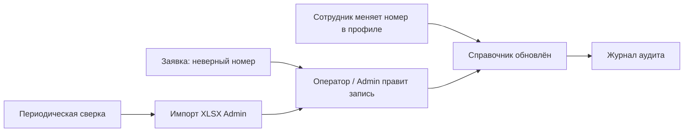

# Концепция телефонного справочника

**Статус:** решение по пути реализации принято (раздел 11)  
**Дата:** 17.07.2026 (редакция решений — 21.07.2026)  
**Область:** ИАС УТС — раздел справки / Help Desk для роли «пользователь»  
**Связанные документы:** [РОЛИ_И_ПРАВА_ДОСТУПА.md](РОЛИ_И_ПРАВА_ДОСТУПА.md), [ТРЕБОВАНИЯ_К_СИСТЕМЕ.md](ТРЕБОВАНИЯ_К_СИСТЕМЕ.md), [ОПИСАНИЕ_РЕАЛИЗАЦИИ_ТЕЛЕФОННОГО_СПРАВОЧНИКА.md](ОПИСАНИЕ_РЕАЛИЗАЦИИ_ТЕЛЕФОННОГО_СПРАВОЧНИКА.md)

---

## 1. Назначение документа

Документ фиксирует концепцию размещения телефонного справочника в интерфейсе ИАС УТС и принципы его актуализации.

Документ предназначен для последующей реализации. **Выбор варианта источника данных и состава этапов внедрения выполняется отдельно** (см. раздел 8 и раздел 11).

Документ не фиксирует конкретный программный стек и не описывает детальную схему БД до принятия решения по варианту реализации.

---

## 2. Проблема и цель

### 2.1. Проблема

В организации часто возникает необходимость актуализации внутренних телефонных номеров. У пользователя с доступом преимущественно к Help Desk отсутствует единое место для быстрого поиска актуального номера сотрудника или служебной линии.

### 2.2. Цель

Предусматривается:

1. размещение для авторизованного пользователя **читаемого телефонного справочника**;
2. фиксация **регламента актуализации** номеров без превращения Help Desk в административный модуль учёта кадров.

### 2.3. Исходное состояние системы (на момент подготовки концепции)

| Элемент | Состояние |
|---------|-----------|
| Роль `user` | Доступ к разделам: Главная, Заявки, Справка → Контакты |
| Пункт меню «Контакты» | Форма обратной связи (`/site/contact`), не справочник номеров |
| Профиль пользователя | Поле «Внутренний телефон» (`users.phone`); пользователь может изменять свой номер |
| Создание заявки | Телефон для обратной связи может подставляться из профиля |
| Администрирование | Администратор ведёт карточки пользователей (в т.ч. телефон, отдел) |

---

## 3. Границы решения

### 3.1. Входит в концепцию

- просмотр телефонного справочника авторизованными пользователями;
- поиск и фильтрация записей;
- актуализация собственного номера через профиль;
- каналы исправления чужих/служебных данных (заявка, администрирование, импорт — по выбранному этапу);
- разграничение прав по ролям.

### 3.2. Не входит (на этапе концепции)

- интеграция с АТС / Active Directory / внешней кадровой системой (может быть рассмотрена отдельно после MVP);
- замена существующих контуров учёта ТС и заявок;
- публичный (неавторизованный) доступ к справочнику.

---

## 4. Размещение в интерфейсе

### 4.1. Основная точка входа — раздел «Справка»

Рекомендуется расширить существующий блок меню «Справка»:

| Было | Предлагается |
|------|--------------|
| Справка → Контакты (форма письма) | Справка → **Телефонный справочник** |
| — | Справка → **Служба поддержки** (контакты ИТ, форма обращения) |

**Обоснование:** раздел «Справка» доступен всем авторизованным пользователям; не требует новых прав на учёт ТС; логически отделён от заявок.

### 4.2. Экран «Телефонный справочник»

Оформление — по паттерну существующих списков системы (поиск, фильтры, таблица), аналогично разделу «Заявки».

**Состав экрана (логическая модель):**

| Элемент | Назначение |
|---------|------------|
| Заголовок | «Телефонный справочник» |
| Индикатор актуальности | Дата/время последнего обновления данных (или последней сверки) |
| Поиск | По ФИО, отделу, кабинету, номеру |
| Фильтры | Например: «Все», «Мой отдел», «Только с номером» |
| Таблица записей | См. п. 4.3 |
| Блок служебных номеров | Приёмная, охрана, АТС и т.п. (при выборе соответствующего варианта данных) |

**Поведение для роли `user`:** только просмотр; клик по номеру — вызов `tel:` и/или копирование в буфер обмена.

### 4.3. Колонки таблицы (MVP)

| Колонка | Обязательность в MVP | Примечание |
|---------|----------------------|------------|
| ФИО | Да | |
| Должность | Желательно | Если заполнено в карточке |
| Подразделение (отдел) | Да | |
| Кабинет / помещение | Желательно | Источник — по выбранному варианту данных |
| Внутренний номер | Да | |
| Городской / мобильный | По решению заказчика | Опционально |

### 4.4. Дополнительные точки доступа

| Место | Назначение |
|-------|------------|
| Мой профиль | Просмотр и изменение собственного номера (уже предусмотрено) |
| Создание заявки | Ссылка «Найти номер в справочнике» (поиск в модальном окне) — этап 2+ |
| Главная | Виджет быстрого поиска сотрудника — по решению заказчика |

### 4.5. Что не отображается обычному пользователю

- администрирование и массовое редактирование;
- импорт;
- журнал изменений;
- служебные признаки источника данных и статуса проверки (кроме обобщённой даты актуальности на экране).

---

## 5. Варианты источника данных

**Решение по варианту принимается до начала реализации.**

### 5.1. Вариант А — на базе `users` (рекомендуется для MVP)

**Суть:** справочник формируется из опубликованных записей пользователей системы.

| Плюсы | Минусы |
|-------|--------|
| Данные уже есть (`phone`, `department`) | Нет кабинетных и общих служебных номеров без расширения |
| Единый источник с профилем и заявками | Сотрудники без учётной записи не попадают в справочник |
| Минимальный объём разработки | Требуются правила публикации |

**Допущение:** для MVP достаточно сотрудников, имеющих учётную запись в ИАС УТС.

### 5.2. Вариант Б — отдельный справочник `phone_directory`

**Суть:** отдельная сущность: сотрудники, кабинеты, службы, общие линии.

| Плюсы | Минусы |
|-------|--------|
| Полнота (приёмная, АТС, кабинеты) | Дублирование с `users` |
| Записи без входа в систему | Выше стоимость сопровождения |

### 5.3. Вариант В — гибрид (целевой на перспективу)

- персональные номера — из `users` (связь 1:1);
- служебные / кабинетные — отдельная таблица или справочник служебных номеров;
- синхронизация по регламенту (на первом этапе — без автоматической интеграции с внешними системами).

### 5.4. Рекомендация документа

Для первого релиза — **вариант А**; расширение до **варианта В** — после стабилизации MVP.  
Окончательный выбор фиксируется в разделе 11 настоящего документа.

---

## 6. Актуализация данных

Проблема устаревания номеров решается распределённой ответственностью и контролем, а не только экраном просмотра.

### 6.1. Роли в процессе

| Роль | Ответственность |
|------|-----------------|
| Сотрудник (`user`) | Поддерживает свой номер в профиле; сообщает об ошибках |
| Куратор подразделения | Проверяет номера своего отдела (функциональная роль или делегирование — по решению заказчика) |
| Оператор Help Desk | Принимает заявки о неверных данных в справочнике |
| Администратор | Массовое обновление, импорт, публикация, служебные номера |

### 6.2. Каналы обновления

| Код | Канал | Описание |
|-----|-------|----------|
| К1 | Самообслуживание | Пользователь изменяет `phone` / `room` в «Мой профиль»; изменение отражается в справочнике; фиксируется в журнале аудита |
| К1а | Правка справочника (admin) | При сохранении записи с `user_id` в карточку пользователя переносятся **только** `phone` и `room` (кабинет); пароль, роли, email не изменяются |
| К2 | Заявка Help Desk | Тип обращения «Актуализация телефонного справочника»; исполнитель — оператор/администратор; закрытие заявки = обновление записи |
| К3 | Администрирование | Правка в разделе «Пользователи»; при необходимости — массовый импорт XLSX |
| К4 | Периодическая сверка | 1–2 раза в год: напоминание сотрудникам и/или подтверждение кураторами; на экране — дата последней сверки |

### 6.3. Процесс (логическая схема)

### 6.4. Правила качества данных

1. **Единый формат номера** — внутренний номер в формате `X-XX`, серии **4–8** (диапазоны `4-01…4-99` … `8-01…8-99`); выбор из списка; допускается общий номер (предупреждение о занятости без блокировки). Городские номера — отдельно (формат уточняется).
2. **Обязательность** — на MVP номер рекомендуется (опция «Не указан»); на этапе 2+ может быть обязателен при первом входе (по решению заказчика).
3. **Публикация** — в справочник попадают активные пользователи с признаком «отображать в справочнике» (при введении такого поля — по умолчанию «да»).
4. **Кабинет** — из профиля и/или из `locations` по закреплённой технике; при отсутствии данных — отображается «—».
5. **Конфликт источников** — приоритет у последнего подтверждённого изменения с фиксацией источника в аудите.

---

## 7. Требования (для включения в ТЗ после выбора варианта)

Нумерация ниже — рабочая; при включении в [ТРЕБОВАНИЯ_К_СИСТЕМЕ.md](ТРЕБОВАНИЯ_К_СИСТЕМЕ.md) / TZ.md подлежит согласованию с общей нумерацией раздела 5.

### 7.1. Функциональные требования — просмотр

7.1.1. Система должна обеспечивать авторизованным пользователям просмотр телефонного справочника в разделе «Справка».

7.1.2. Система должна обеспечивать поиск по ФИО, подразделению, кабинету и номеру телефона.

7.1.3. Система должна отображать сведения о дате (и при необходимости времени) последнего обновления данных справочника или последней сверки.

### 7.2. Функциональные требования — актуализация

7.2.1. Система должна обеспечивать пользователю изменение собственного внутреннего номера в профиле.

7.2.2. Система должна обеспечивать создание заявки с типом «Актуализация телефонного справочника» для сообщения о неверных данных (этап 2+).

7.2.3. Система должна обеспечивать администратору массовое обновление записей справочника, в том числе импорт из файла (этап 3+).

7.2.4. Система должна фиксировать изменения телефонных данных в журнале аудита.

### 7.3. Требования к разграничению доступа

| Операция | Пользователь | Оператор | Администратор |
|----------|:------------:|:--------:|:-------------:|
| Просмотр справочника | Да | Да | Да |
| Изменение своего номера | Да | Да | Да |
| Обработка заявок на актуализацию | Нет | Да | Да |
| Администрирование / импорт | Нет | Нет | Да |

7.3.1. Роль `user` — просмотр справочника и редактирование собственного номера.

7.3.2. Роль `operator` — просмотр и обработка заявок на актуализацию.

7.3.3. Роль `admin` — полное администрирование и импорт.

### 7.4. Нефункциональные требования

7.4.1. Время отклика поиска — не более 1 с при объёме до 500 записей (ориентир для MVP).

7.4.2. Справочник должен быть доступен без прав на учёт технических средств.

7.4.3. Данные справочника не должны отображаться неавторизованным пользователям.

7.4.4. Интерфейс списка должен обеспечивать использование на рабочих станциях предприятия (в т.ч. адаптация таблицы: горизонтальная прокрутка или карточный вид на узких экранах).

---

## 8. Этапы внедрения (ориентир)

| Этап | Состав | Примечание |
|------|--------|------------|
| **1. MVP** | Экран справочника (вариант А); переименование/разделение «Контакты»; самообслуживание в профиле | Минимальный путь |
| **2** | Заявка «Актуализация справочника»; блок служебных номеров | После выбора А или В |
| **3** | Импорт XLSX; кураторы подразделений; напоминание о сверке | |
| **4** | Интеграция с АТС / AD (при наличии API) | Отдельное ТЗ |

Путь реализации (состав этапов и вариант данных) утверждается отдельно и фиксируется в разделе 11.

---

## 9. Допущения

1. Справочник публикуется только для авторизованных пользователей.
2. На MVP в персональный перечень входят сотрудники с учётной записью в ИАС УТС.
3. Текущая форма «Контакты» не удаляется, а переносится в пункт «Служба поддержки» (или сохраняется под согласованным наименованием).
4. Конкретный стек реализации не навязывается настоящим документом.

---

## 10. Открытые вопросы к заказчику

| № | Вопрос | Влияние на реализацию |
|---|--------|------------------------|
| 1 | Нужны ли в справочнике кабинетные и общие номера (приёмная, охрана, АТС)? | Выбор варианта А / Б / В |
| 2 | Кто выполняет роль куратора по подразделениям? | Канал К4, права |
| 3 | Обязателен ли внутренний номер для всех пользователей? | Валидация, онбординг |
| 4 | Существует ли внешний эталонный источник (Excel, 1С, АТС)? | Импорт, этап 4 |
| 5 | Какой формат внутреннего номера считать нормативным? | Валидация UI/БД |

---

## 11. Решение по пути реализации

**Статус:** принято.

| Параметр | Решение | Дата | Примечание |
|----------|---------|------|-----------|
| Вариант источника данных (А / Б / В) | **Б** | 21.07.2026 | Отдельная таблица `phone_directory` |
| Состав MVP (этап 1) | **этапы 1–2** | 21.07.2026 | Экран, меню, кабинет, служебные номера, заявка |
| Необходимость служебных номеров в MVP | **да** | 21.07.2026 | `entry_type = service` |
| Тип заявки на актуализацию | **`phone_directory_update`** | 21.07.2026 | Поле `tasks.request_category` |

Чекпоинт отката кода: git-тег `checkpoint/pre-phone-directory` (команда «Откат»).

После принятия решения таблицу заполнить и при необходимости внести требования в TZ.md / ТРЕБОВАНИЯ_К_СИСТЕМЕ.md и матрицу прав.

---

## 12. Итоговая рекомендация (для обсуждения)

1. Разместить телефонный справочник в разделе **«Справка»**, отделив его от формы обращения в службу поддержки.
2. Обеспечить актуализацию через каналы: **самообслуживание** → **заявка на исправление** → **администрирование / импорт + периодическая сверка**.
3. На старте опереться на существующее поле `users.phone`, не создавая отдельную тяжёлую подсистему до подтверждения потребности в служебных номерах и внешних источниках.

---

## 13. История изменений

| Дата | Изменение |
|------|-----------|
| 21.07.2026 | Добавлено описание реализации; ссылка на ОПИСАНИЕ_РЕАЛИЗАЦИИ_ТЕЛЕФОННОГО_СПРАВОЧНИКА.md |
| 21.07.2026 | Обратная синхронизация: при сохранении записи справочника с `user_id` в `users` обновляются только `phone` и `room` |
| 21.07.2026 | Формат внутренних номеров: X-XX, серии 4–8; выбор из списка с предупреждением о занятости; городские — отдельно |
| 21.07.2026 | Принято решение: вариант Б, этапы 1–2; зафиксирован чекпоинт `checkpoint/pre-phone-directory` |
| 17.07.2026 | Первая редакция концепции |
