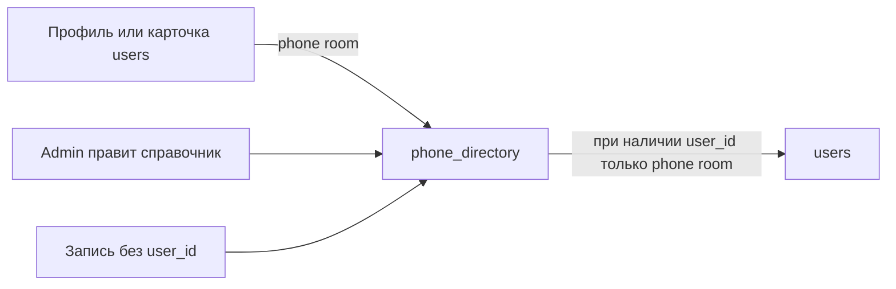

# Описание реализации телефонного справочника

**Статус:** реализовано (этапы 1–2, вариант Б)  
**Дата:** 21.07.2026  
**Область:** ИАС УТС — раздел «Справка»  
**Концепция:** [КОНЦЕПЦИЯ_ТЕЛЕФОННОГО_СПРАВОЧНИКА.md](КОНЦЕПЦИЯ_ТЕЛЕФОННОГО_СПРАВОЧНИКА.md)  
**Чекпоинт отката кода:** git-тег `checkpoint/pre-phone-directory`  
(команда «Откат»: `git reset --hard checkpoint/pre-phone-directory`; миграции БД откатываются отдельно)

---

## 1. Назначение

В системе реализован читаемый телефонный справочник для авторизованных пользователей и контур актуализации номеров без превращения Help Desk в кадровый модуль.

Предусмотрено:

1. просмотр справочника в разделе «Справка»;
2. поиск и фильтрация записей;
3. самообслуживание собственного внутреннего номера и кабинета в профиле;
4. ведение записей администратором (в т.ч. служебные номера и сотрудники без учётной записи);
5. заявка категории «Актуализация телефонного справочника»;
6. двусторонняя синхронизация полей **телефон** и **кабинет** между `users` и `phone_directory` при наличии связи `user_id`.

---

## 2. Принятые решения

| Параметр | Решение |
|----------|---------|
| Источник данных | **Вариант Б** — отдельная таблица `phone_directory` |
| Состав внедрения | **Этапы 1 и 2** концепции |
| Служебные номера | Да (`entry_type = service`) |
| Кабинет | Поле `room` в справочнике и в `users` |
| Тип заявки на актуализацию | `tasks.request_category = phone_directory_update` |
| Формат внутреннего номера | `X-XX`, серии **4–8** (`4-01…4-99` … `8-01…8-99`) |
| Уникальность номера | Мягкая: предупреждение о занятости, сохранение допускается (общий номер) |
| Городские номера | Поле `external_phone` — свободный ввод; формат не зафиксирован |

---

## 3. Размещение в интерфейсе

Меню «Справка» ([`views/layouts/_sidebar.php`](../../ias_uch_vnii/views/layouts/_sidebar.php)):

| Пункт | Маршрут | Назначение |
|-------|---------|------------|
| Телефонный справочник | `/phone-directory/index` | Список записей, поиск, фильтры |
| Служба поддержки | `/site/contact` | Форма обращения (ранее «Контакты») |

Экран справочника:

- заголовок и индикатор актуальности (`MAX(updated_at)` по опубликованным записям);
- поиск по ФИО, подразделению, кабинету, номеру;
- фильтры: Все / Мой отдел / Только с номером / Служебные;
- таблица AG Grid: ФИО/название, должность, подразделение, кабинет, внутренний номер, тип;
- клик по номеру — `tel:` и копирование;
- кнопка «Сообщить об ошибке» — создание заявки с категорией актуализации;
- для администратора: «Добавить», «Из users», редактирование/удаление записи.

---

## 4. Модель данных

### 4.1. Таблица `phone_directory`

Миграция: `m260721_100000_phone_directory.php`.

| Поле | Назначение |
|------|------------|
| `entry_type` | `person` \| `service` |
| `full_name` | ФИО сотрудника или название службы |
| `position`, `department`, `room` | Должность, подразделение, кабинет |
| `internal_phone` | Внутренний номер (`X-XX`) |
| `external_phone` | Городской / мобильный (свободный текст) |
| `user_id` | Связь с `users` (nullable, уникальный индекс) |
| `is_published` | Признак публикации в справочнике |
| `sort_order` | Порядок сортировки |
| `created_at`, `updated_at` | Метки времени |

Первичное наполнение миграции:

- служебные заглушки: Приёмная, Охрана, АТС;
- импорт активных пользователей из `users` в записи `person`.

### 4.2. Дополнения к существующим таблицам

| Миграция | Изменение |
|----------|-----------|
| `m260721_110000_users_room` | Поле `users.room` (кабинет) |
| `m260721_120000_tasks_request_category` | Поле `tasks.request_category` |

---

## 5. Синхронизация `users` ↔ `phone_directory`

Синхронизируются **только** внутренний телефон и кабинет (`phone` / `internal_phone`, `room`).  
Пароль, роли, email и прочие поля пользователя не затрагиваются.

| Направление | Условие | Поведение |
|-------------|---------|-----------|
| `users` → справочник | Сохранение пользователя (в т.ч. профиль) | `PhoneDirectory::syncFromUser` |
| Справочник → `users` | Сохранение записи с `user_id` | `PhoneDirectory::syncPhoneRoomToUser` через `updateAttributes` (без зацикливания) |
| Без `user_id` | Сотрудник без учётки | Только справочник |

Повторная синхронизация из пользователей:

- UI (admin): кнопка «Из users»;
- консоль: `php yii phone-directory/sync`.

---

## 6. Формат внутренних номеров

Реализовано в [`InternalPhoneHelper`](../../ias_uch_vnii/components/InternalPhoneHelper.php).

1. Канонический вид: `4-15`, `8-03` и т.п.
2. Серии: 4, 5, 6, 7, 8; суффикс 01–99.
3. В формах выбора — выпадающий список с группировкой по сериям, пункт «Не указан».
4. В подписи варианта отображается занятость (из `phone_directory` и `users`), без блокировки сохранения.
5. Серверная валидация отклоняет значения вне диапазона.
6. Городской номер (`external_phone`) и телефон обратной связи в заявке (`tasks.contact_phone`) остаются свободным вводом.

Места выбора внутреннего номера (не свободный текст):

| Место | Файл / действие |
|-------|-----------------|
| Мой профиль | `views/users/_profile_form_modal.php` |
| Карточка пользователя (admin, модалка) | `views/users/_form_modal.php` |
| Форма пользователя | `views/users/_form.php` |
| Запись справочника (admin) | `views/phone-directory/_form_modal.php` |

Общий partial: `views/partials/_internal_phone_field.php`.

---

## 7. Права доступа

| Операция | user | operator | admin |
|----------|:----:|:--------:|:-----:|
| Просмотр справочника | Да | Да | Да |
| Изменение своего phone/room в профиле | Да | Да | Да |
| CRUD записей справочника, синхронизация из users | Нет | Нет | Да |
| Создание/обработка заявок актуализации | Создание | Да | Да |

Доступ к экрану справочника: все авторизованные (`@`), без прав на учёт ТС.

---

## 8. Заявки на актуализацию

- Поле `tasks.request_category`.
- Значение `phone_directory_update` — «Актуализация телефонного справочника».
- Предустановка из справочника: кнопка «Сообщить об ошибке» → `/tasks/create?request_category=phone_directory_update`.
- В форме создания заявки — выбор категории; в карточке заявки категория отображается.
- Фильтрация по `request_category` поддержана в `TasksSearch`.

---

## 9. Состав программных артефактов

| Слой | Путь |
|------|------|
| Миграции | `ias_uch_vnii/migrations/m260721_*` |
| Entity | `models/entities/PhoneDirectory.php` |
| Search | `models/search/PhoneDirectorySearch.php` |
| Helper | `components/InternalPhoneHelper.php` |
| Web-контроллер | `controllers/PhoneDirectoryController.php` |
| Console | `commands/PhoneDirectoryController.php` (`phone-directory/sync`) |
| Views | `views/phone-directory/*`, `views/partials/_internal_phone_field.php` |
| Assets / JS / CSS | `assets/PhoneDirectoryAsset.php`, `web/js/phone-directory/*`, `web/js/internal-phone-select.js`, `web/css/phone-directory/page.css` |
| Аудит | `AuditLog` на create/update/delete справочника, sync, обновление профиля |

---

## 10. Аудит

Фиксируются события (при доступности таблицы `audit_events`):

- `phone_directory.create` / `update` / `delete`;
- `phone_directory.sync_from_users`;
- `user.profile_update` (в т.ч. phone/room).

---

## 11. Вне текущего объёма (по концепции)

- Массовый импорт XLSX, кураторы подразделений, периодическая сверка (этап 3).
- Интеграция с АТС / Active Directory (этап 4).
- Виджет на главной и модальный поиск номера из формы заявки (кроме кнопки «Сообщить об ошибке»).
- Нормативный формат городских номеров.

---

## 12. Проверка работоспособности (краткий чек-лист)

1. Под ролью `user`: открыть «Справка → Телефонный справочник», убедиться в наличии строк (не пустой экран).
2. Поиск и фильтры; копирование / `tel:` по внутреннему номеру.
3. Профиль: выбор номера из списка серий 4–8 и кабинета → запись появляется/обновляется в справочнике.
4. Под `admin`: правка записи справочника с `user_id` → в карточке пользователя обновились только телефон и кабинет.
5. «Сообщить об ошибке» → заявка с категорией актуализации.
6. При необходимости: `php yii phone-directory/sync`.

---

## 13. История документа

| Дата | Изменение |
|------|-----------|
| 21.07.2026 | Первая редакция описания реализации |
