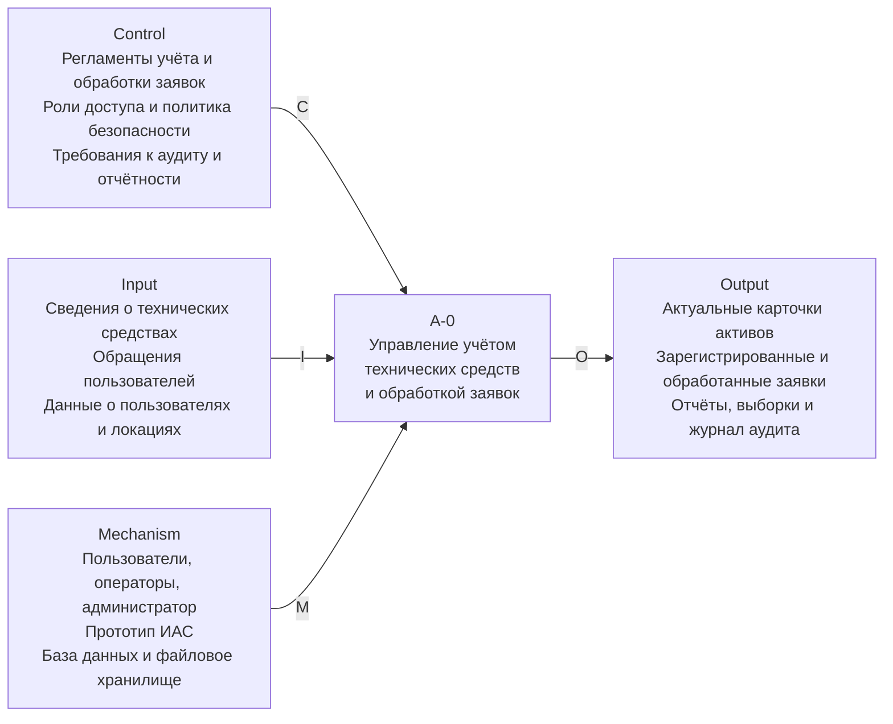
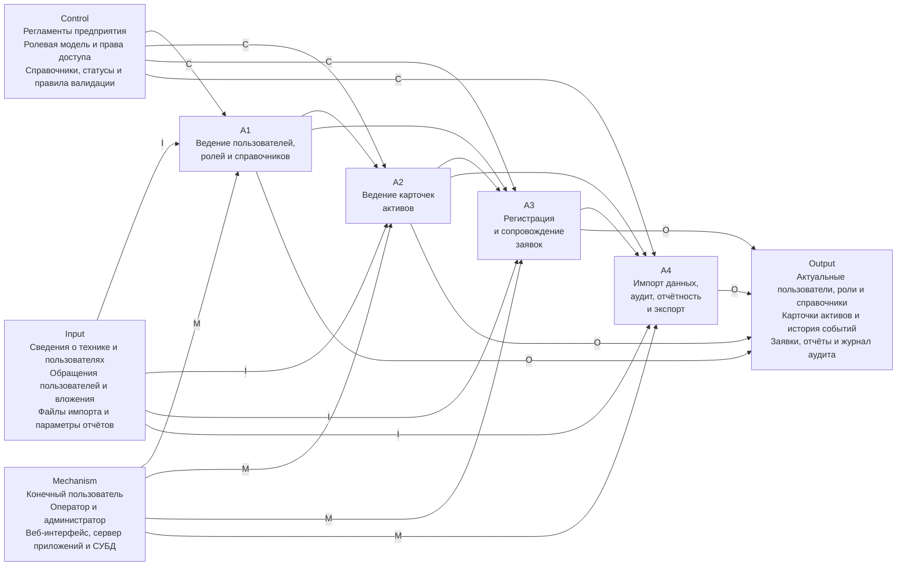

# Черновик IDEF0-диаграмм для просмотра

Документ подготовлен отдельно от основного текста ВКР и предназначен только для просмотра и согласования перед возможной вставкой в главу 1.

Примечание: Mermaid не поддерживает нотацию IDEF0 в строгом виде, поэтому ниже приведена адаптированная визуализация IDEF0-логики средствами `graph LR`. Для приближения к IDEF0 использована явная схема `ICOM` с пометками стрелок: `I` (Input), `C` (Control), `O` (Output), `M` (Mechanism). Для предварительного согласования структуры этого достаточно; при необходимости итоговые схемы можно позднее перенести в draw.io, Visio или другой редактор с более строгим оформлением IDEF0.

---

## Вариант 1. Контекстная диаграмма A-0

Предлагаемая подпись:

`Рисунок 1.6 — Контекстная IDEF0-диаграмма процессов учёта технических средств и обработки заявок`


```text
Diagram: IDEF0 A-0 (context)
  [Control: регламенты, роли, аудит] ---- C ----\
                                                 > [A-0 Управление учетом ТС и обработкой заявок] ---- O ----> [Output: карточки, заявки, отчеты]
  [Input: активы, обращения, пользователи] - I -/

  [Mechanism: пользователи, ИАС, БД] ----- M --------------------------------> [A-0]
```

Краткий смысл:

- функция верхнего уровня описывает систему как единый процесс;
- входы отражают поступающие данные и обращения;
- управления задают регламенты и ограничения;
- механизмы показывают, за счёт чего процесс реализуется;
- выходы фиксируют результаты функционирования системы.

---

## Вариант 2. Декомпозиция A0

Предлагаемая подпись:

`Рисунок 1.7 — Декомпозиция основных процессов прототипа ИАС в нотации IDEF0`


```text
Diagram: IDEF0 A0 (decomposition)
  [Control] -- C --> [A1 Пользователи, роли, справочники] --> [A2 Карточки активов] --> [A3 Заявки] --> [A4 Импорт, аудит, отчетность] -- O --> [Output]
  [Input]   -- I --> [A1]
  [Input]   -- I --> [A2]
  [Input]   -- I --> [A3]
  [Input]   -- I --> [A4]
  [Mechanism] -- M --> [A1]
  [Mechanism] -- M --> [A2]
  [Mechanism] -- M --> [A3]
  [Mechanism] -- M --> [A4]
```

Краткий смысл:

- `A1` задаёт нормативную и учётную основу: пользователи, роли, справочники;
- `A2` отражает контур учёта технических средств;
- `A3` отражает процессы Help Desk;
- `A4` объединяет сквозные сервисные процессы: импорт, аудит, отчётность и экспорт.

---

## Где потом можно вставлять

- `A-0` логично размещать в разделе `1.2` как обобщённую схему бизнес-процессов;
- `A0` можно ставить сразу после `A-0` либо в конце раздела `1.2` как детализацию.

---

## Отдельные исходники Mermaid

Для удобства просмотра и последующего экспорта также подготовлены отдельные файлы:

- `docs/vkr/export/mermaid-src/chapter1_fig_6_idef0_context.mmd`
- `docs/vkr/export/mermaid-src/chapter1_fig_7_idef0_decomposition.mmd`

После рендера превью рядом будут размещены и отдельные графические файлы:

- `docs/vkr/export/preview/idef0/svg/*.svg`
- `docs/vkr/export/preview/idef0/png/*.png`
