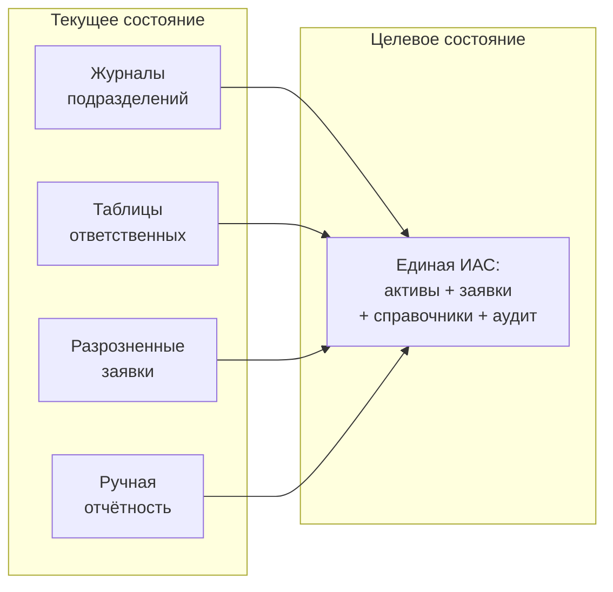
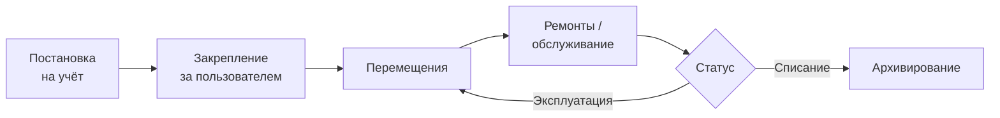
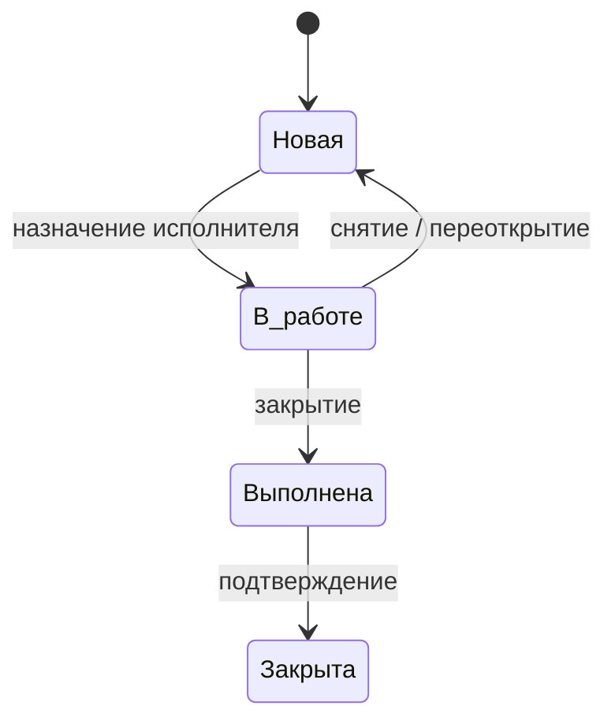
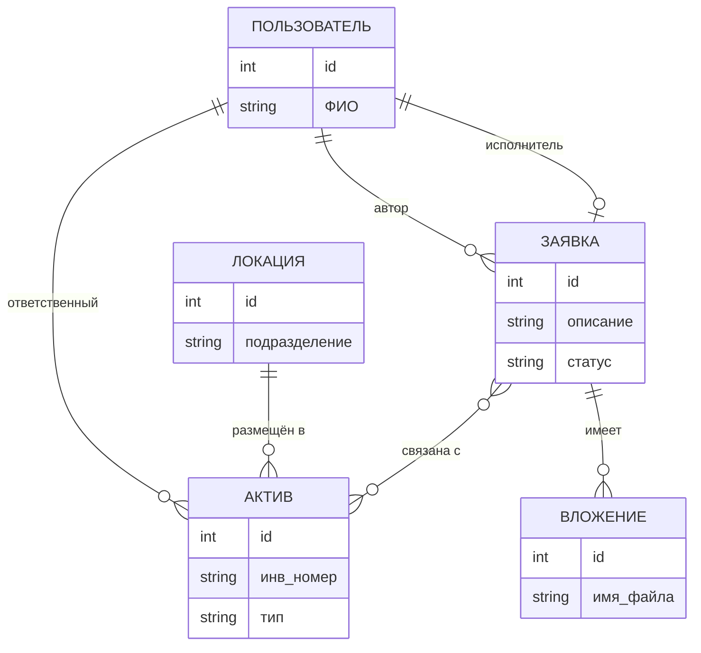

# Раздел 1. Анализ проблемы и формирование требований к системе

Документ подготовлен в соответствии с планом ВКР по теме «Проектирование и разработка прототипа информационно-аналитической системы учёта технических средств предприятия». Раздел охватывает подпункты 1.1–1.5 плана работы и предназначен для включения в первую главу выпускной квалификационной работы.

---

## 1.1. Постановка проблемы учёта технических средств и процессов Help Desk

На промышленных предприятиях и в проектных организациях учёт технических средств (активов) и сопровождение обращений пользователей (процессы Help Desk) нередко ведутся в разрозненных таблицах, локальных журналах или с частичным использованием электронных средств без единого источника данных. Данная ситуация порождает ряд системных недостатков, обосновывающих необходимость централизации и автоматизации.

### 1.1.1. Недостатки разрозненного и ручного учёта

**Высокие трудозатраты на ввод и согласование данных.** Ввод сведений об активах и заявках дублируется в нескольких местах: в журналах подразделений, в таблицах ответственных лиц, при формировании отчётности. Согласование изменений (перемещение техники, смена ответственного, закрытие заявки) выполняется вручную и не опирается на единый реестр, что увеличивает время обработки и риск ошибок.

**Риски расхождений между подразделениями.** Отсутствие единого источника данных приводит к тому, что сведения об одном и том же активе или заявке в разных подразделениях могут различаться. Расхождения затрудняют планирование обслуживания, проведение инвентаризации и выполнение требований аудита.

**Сложности поиска информации об активе и истории обращений.** При разрозненном учёте поиск информации о конкретной единице техники (текущее местоположение, ответственный, история перемещений и ремонтов) требует обращения к нескольким источникам. Аналогично затруднён поиск истории обращений по активу или по пользователю, что снижает оперативность реагирования и качество поддержки.

**Отсутствие единого источника для отчётности и аудита.** Формирование отчётности по активам, заявкам и исполнителям требует ручной сводки данных из разных источников. Аудит изменений (кто, когда и что изменил) при отсутствии централизованного журналирования невозможен в полном объёме, что создаёт риски с точки зрения контроля и соответствия регламентам.

### 1.1.2. Обоснование необходимости централизации и автоматизации

Централизация данных об активах и заявках в рамках единой информационно-аналитической системы обеспечивает:

- единый реестр технических средств с привязкой к пользователям и локациям;
- единый реестр обращений (заявок) с возможностью привязки к активам и ведения истории изменений;
- снижение трудозатрат за счёт однократного ввода данных и использования их во всех процессах;
- возможность оперативного поиска и фильтрации по активам, заявкам и пользователям;
- формирование отчётности и аналитики на основе актуальных данных;
- фиксацию действий пользователей в журнале аудита для контроля и расследования инцидентов.

Автоматизация ведения карточек активов (создание, редактирование, закрепление, перемещение, архивирование) и процессов сопровождения заявок (регистрация, назначение исполнителя, смена статуса, комментарии, вложения) уменьшает долю ручных операций и снижает вероятность ошибок, обеспечивая при этом прозрачность и управляемость процессов для предприятия.

Таким образом, постановка проблемы сводится к следующему: в условиях разрозненного и преимущественно ручного учёта активов и заявок необходимо обеспечить централизацию данных и автоматизацию ключевых процессов в рамках специализированной информационно-аналитической системы, пригодной для эксплуатации в производственной среде предприятия.

Соотношение текущего состояния (разрозненные источники данных) и целевого (единая ИАС) иллюстрируется на рисунке 1.

**Рисунок 1 — Переход от разрозненного учёта к централизованной ИАС** *(рекомендуется разместить после п. 1.1.2)*

---

## 1.2. Анализ предметной области и бизнес-процессов

В рамках анализа предметной области исследуются процессы учёта технических средств, процессы Help Desk, роли пользователей и структуры ключевых сущностей системы.

### 1.2.1. Процессы учёта технических средств

Учёт технических средств охватывает полный жизненный цикл актива от постановки на учёт до вывода из эксплуатации. К основным процессам относятся:

| Процесс | Описание |
|--------|-----------|
| Постановка на учёт | Регистрация новой единицы техники с формированием карточки актива, внесением обязательных атрибутов (тип, идентификаторы, локация) и при необходимости технических характеристик. |
| Закрепление за пользователем | Назначение ответственного лица за актив с фиксацией в карточке и в истории событий. |
| Перемещения | Изменение локации актива (подразделение, помещение/кабинет) с фиксацией даты, пользователя и основания. |
| Ремонты и обслуживание | Фиксация фактов ремонта или обслуживания в истории событий актива; при необходимости связь с заявками Help Desk. |
| Списание | Вывод актива из эксплуатации с изменением статуса и сохранением истории. |
| Архивирование | Логическое исключение актива из актуального учёта с сохранением данных и связей для отчётности и аудита. |

Перечисленные процессы должны поддерживаться системой с фиксацией изменений в истории событий и в журнале аудита. Жизненный цикл актива в обобщённом виде представлен на рисунке 2.

**Рисунок 2 — Жизненный цикл актива (учёт технических средств)** *(рекомендуется разместить после п. 1.2.1)*

### 1.2.2. Процессы Help Desk

Процессы сопровождения обращений пользователей (Help Desk) включают:

| Процесс | Описание |
|--------|-----------|
| Регистрация заявки | Создание заявки пользователем с указанием описания, при необходимости — привязки к активам и загрузки вложений. |
| Назначение исполнителя | Назначение ответственного за выполнение заявки уполномоченным пользователем (оператор, администратор). |
| Смена статуса | Изменение статуса заявки в соответствии со справочником статусов (например: новая, в работе, выполнена, закрыта). |
| Работа с вложениями | Прикрепление файлов к заявке при создании или редактировании; хранение метаданных; скачивание и предпросмотр в пределах прав доступа. |
| Связь заявки с активом | Указание одного или нескольких активов, к которым относится обращение; отображение связанных заявок в карточке актива. |

Дополнительно предусматриваются ведение комментариев по заявке с фиксацией автора и даты/времени, а также хранение истории изменения ключевых атрибутов заявки (статус, исполнитель). Упрощённый жизненный цикл заявки Help Desk показан на рисунке 3.

**Рисунок 3 — Жизненный цикл заявки Help Desk** *(рекомендуется разместить после п. 1.2.2)*

### 1.2.3. Роли пользователей

В системе выделяются следующие роли, определяющие объём доступа к данным и операциям:

| Роль | Назначение |
|------|------------|
| Конечный пользователь | Создание и просмотр собственных заявок; просмотр заявок, где пользователь назначен исполнителем; просмотр сведений о закреплённой за ним технике. |
| Оператор | Доступ ко всем заявкам: просмотр, смена статуса, назначение исполнителя, комментарии; просмотр перечня техники пользователей в контексте заявок; просмотр и редактирование карточек активов в пределах регламента (например, при наличии прав ответственного или по решению администратора). |
| Исполнитель | Выполнение заявок в рамках назначения; права определяются в совокупности с ролью пользователя или оператора. |
| Администратор | Полный доступ к данным и настройкам: управление пользователями и ролями, ведение карточек активов и справочников, доступ ко всем заявкам и журналу аудита, импорт данных, учёт ПО и лицензий. |

Разграничение доступа обеспечивается на основе ролевой модели с проверкой прав на серверной стороне при каждой операции изменения данных.

### 1.2.4. Ключевые сущности системы

**Карточка актива** формируется на каждую единицу технического средства и содержит: наименование (тип актива), инвентарный номер или учётную пометку, серийный номер, марку и модель, ответственного (закреплённое лицо), локацию (подразделение, помещение), даты (приобретения, ввода в эксплуатацию, гарантийный срок), эксплуатационный статус, признак архивирования, технические характеристики (конфигурация) в виде набора пар «составная часть — характеристика — значение» по справочникам, а также историю событий (перемещения, закрепление/снятие, ремонты, списание, изменение ключевых атрибутов).

**Карточка пользователя** представляет собой сводное представление по одному пользователю (сотруднику): ФИО и учётные данные, перечень активов, закреплённых за пользователем (выборка по связи «актив — ответственный»), с группировкой по типу техники; при необходимости — локации и краткие атрибуты активов для отображения в интерфейсе и отчётах.

**Заявка (обращение Help Desk)** содержит: автора заявки, описание (текст обращения), статус заявки (по справочнику), исполнителя (при назначении), дату/время создания и последнего изменения, связанные активы (привязка к одному или нескольким активам), комментарии с фиксацией автора и даты/времени, вложения (файлы) с метаданными, историю изменения ключевых атрибутов (статус, исполнитель и т.д.).

Данные сущности образуют ядро предметной области и должны быть полностью поддержаны прототипом системы в соответствии с сформированными требованиями. Связи между ключевыми сущностями отражены на рисунке 4.

**Рисунок 4 — Ключевые сущности предметной области и связи между ними** *(рекомендуется разместить после п. 1.2.4)*

---

## 1.3. Анализ существующих решений и аналогичных продуктов

Сравнительный обзор проводится по трём направлениям: корпоративные системы учёта активов (IT Asset Management), системы Help Desk и службы поддержки, комплексные информационно-аналитические системы предприятия.

### 1.3.1. Системы учёта активов (IT Asset Management)

Рынок предлагает специализированные решения для учёта ИТ-активов: коммерческие продукты (например, ServiceNow ITAM, Ivanti, Flexera, BMC Helix), а также открытые и корпоративные решения. Типичные возможности: реестр активов с атрибутами, привязка к пользователям и локациям, учёт конфигурации и лицензий ПО, отчётность и аудит. Ограничения применительно к задаче предприятия: высокая стоимость лицензий и внедрения для малых и средних организаций; избыточная функциональность (управление контрактами, финансовый учёт активов); не всегда предусмотрена глубокая интеграция учёта активов с процессами Help Desk в едином интерфейсе и единой модели данных. Для предприятия с потребностью в централизованном учёте техники и заявок в одном прототипе целесообразность приобретения тяжёлого ITAM-продукта может быть ограничена.

### 1.3.2. Системы Help Desk и службы поддержки

Системы учёта заявок и обращений (Help Desk, Service Desk, тикет-системы) широко представлены: Jira Service Management, Zendesk, Freshdesk, GLPI, osTicket, Request Tracker и др. Они обеспечивают регистрацию заявок, статусы, назначение исполнителей, комментарии, вложения, отчётность. Ограничения: многие из них не содержат полноценного контура учёта технических средств с карточками активов, историей жизненного цикла и привязкой к справочникам предприятия (локации, типы техники, конфигурация). Учёт «оборудования» часто сводится к справочнику конфигурационных единиц (CI) без детализации, принятой в учёте ТС на предприятии (инв. номер, МЦ.04, закрепление, перемещения). Таким образом, использование только тикет-системы не закрывает потребность в едином учёте активов и заявок с глубокой связью «заявка — актив».

### 1.3.3. Комплексные ИАС предприятия

Корпоративные информационно-аналитические системы могут включать модули учёта техники, заявок, справочников и аудита. Их преимущество — единая платформа и согласованная модель данных. Ограничения: длительные сроки и высокая стоимость внедрения; зависимость от вендора; не всегда имеется готовая конфигурация под специфику учёта ТС и Help Desk конкретного предприятия (учётная пометка МЦ.04, внутренние справочники, регламенты доступа). Разработка специализированного прототипа ИАС позволяет реализовать только необходимый функционал с учётом существующих регламентов и ограничений предприятия.

### 1.3.4. Сводное сопоставление аналогов

В таблице 1 приведено сопоставление возможностей и ограничений рассмотренных направлений применительно к задаче централизованного учёта технических средств и сопровождения обращений на предприятии.

**Таблица 1 — Сопоставление аналогов применительно к задаче учёта ТС и Help Desk**

| Критерий | ITAM-системы | Системы Help Desk | Комплексные ИАС | Специализированный прототип ИАС |
|----------|--------------|-------------------|-----------------|---------------------------------|
| Учёт активов (карточки, история, локация, ответственный) | Да, развитый | Частично (CI) или нет | Зависит от конфигурации | Да, по требованиям предприятия |
| Регистрация и сопровождение заявок (статусы, исполнитель, вложения) | Часто через интеграцию | Да | Зависит от конфигурации | Да |
| Связь заявка — актив | Часто есть | Не всегда детальная | Зависит от конфигурации | Да |
| Справочники (типы активов, локации, статусы заявок) | Да | Частично | Да | Да |
| Аудит действий пользователей | Обычно есть | Частично | Зависит от конфигурации | Да |
| Соответствие регламентам и номенклатуре предприятия | Требует настройки | Ограничено | Требует проектирования | Максимально при проектировании под задачу |
| Сроки и стоимость внедрения | Высокие | Средние | Высокие | Ограничены рамками прототипа |

Вывод: для обеспечения централизованного учёта ТС и сопровождения обращений на предприятии в рамках ограниченных сроков и ресурсов целесообразна разработка специализированного прототипа ИАС с явной поддержкой учёта техники, заявок, вложений, справочников и аудита в единой модели данных.

---

## 1.4. Сравнение подходов к учёту активов и автоматизации Help Desk

В данном подразделе рассматриваются подходы к моделированию данных, к организации импорта и миграции данных, а также к разграничению доступа и ведению аудита в рамках прототипа ИАС.

### 1.4.1. Моделирование данных

**Актив — пользователь — локация.** Распространённый подход — представление актива как сущности с атрибутами «ответственный» (пользователь) и «локация» (подразделение, помещение). Это обеспечивает быстрый поиск активов по месту нахождения и по закреплённому лицу, а также формирование карточки пользователя как выборки активов по связи «актив — ответственный». В прототипе принимается явная связь актива с пользователем и локацией через ссылки на справочники/учётные записи.

**Конфигурация как набор характеристик.** Технические характеристики актива (процессор, ОЗУ, накопитель, сетевое имя, IP и т.д.) могут храниться в виде жёсткого набора полей в карточке актива или в виде набора пар «составная часть — характеристика — значение» по справочникам. Второй подход обеспечивает гибкость при изменении номенклатуры характеристик без изменения схемы БД и согласуется с разнообразием типов техники (ПК, мониторы, МФУ, ИБП и т.д.). В прототипе принимается модель с справочниками типов составных частей и характеристик и связками «актив — составная часть — характеристика — значение».

**Связь заявка — актив.** Заявка может быть связана с одним или несколькими активами для учёта обращений по конкретной технике. В карточке актива предусматривается отображение связанных заявок (в пределах прав доступа). Связь «многие ко многим» или «заявка — несколько активов» позволяет отражать обращения, затрагивающие несколько единиц техники, и используется в прототипе.

### 1.4.2. Импорт и миграция данных

**Форматы.** Для начального наполнения и пополнения данных применяются согласованные форматы: CSV, JSON, XML, XLSX. Выбор форматов определяется возможностями предприятия-заказчика и инструментами подготовки данных.

**Идемпотентность и повторяемость.** Повторный запуск импорта не должен приводить к дублированию записей и нарушению целостности. Обеспечивается либо идемпотентность операций (обновление по ключу при повторной загрузке), либо управляемая повторяемость с явными правилами (например, пропуск уже существующих записей по идентификатору). Правила фиксируются в проектной документации.

**Протокол ошибок.** Система формирует протокол импорта с указанием количества обработанных записей, количества ошибок и перечня ошибок (например, строка/идентификатор, тип ошибки). Это необходимо для корректировки исходных данных и повторной загрузки.

### 1.4.3. Разграничение доступа и аудит

**Разграничение доступа.** В прототипе применяется ролевая модель: права привязаны к ролям (пользователь, оператор, исполнитель, администратор). Проверка прав выполняется на серверной стороне при каждой операции изменения данных (заявки, вложения, карточки активов, пользователи). Доступ к заявкам ограничивается по правилам: пользователь — к своим заявкам и заявкам, где он исполнитель; оператор и администратор — ко всем заявкам. Доступ к карточкам активов — в соответствии с регламентом (например, только администратор и ответственный за актив).

**Ведение аудита.** Регистрируются операции управления пользователями и ролями, изменения заявок (создание, смена статуса, назначение исполнителя, изменение ключевых полей, удаление), операции с вложениями (загрузка, удаление), изменения карточек активов и данных по ПО/лицензиям. В записи аудита фиксируются дата/время, пользователь, тип операции, объект операции, результат (успех/ошибка). Записи журнала аудита не изменяются в рамках установленной модели доступа.

Принятые в прототипе подходы к моделированию данных, импорту и разграничению доступа обеспечивают соответствие сформулированным требованиям и возможность последующего расширения системы.

---

## 1.5. Формирование требований к прототипу системы

На основе анализа проблемы, предметной области, аналогов и подходов формируются функциональные и нефункциональные требования к прототипу информационно-аналитической системы учёта технических средств предприятия.

### 1.5.1. Функциональные требования

Функциональные требования сгруппированы по контурам и направлениям. Детальная нумерация и формулировки приводятся в проектной документации (техническое задание, спецификация требований); ниже даётся сводный перечень, достаточный для обоснования объёма прототипа.

**Управление пользователями, ролями и доступом.** Система должна обеспечивать ведение учётных записей пользователей, аутентификацию, разграничение доступа на основе ролей, назначение и изменение ролей, запрет доступа при отсутствии прав, ведение справочника ролей, механизм восстановления доступа с фиксацией в аудите.

**Ведение нормативно-справочной информации.** Система должна обеспечивать ведение справочников, необходимых для учёта активов и заявок (типы активов, локации, статусы заявок, составные части, характеристики, роли), контроль целостности ссылок, архивирование значений справочников при наличии ссылок, ведение истории изменений справочников.

**Контур Help Desk (заявки).** Система должна обеспечивать регистрацию заявок с обязательными атрибутами, ведение справочника статусов и управление жизненным циклом заявки через смену статуса, назначение и снятие исполнителя, ведение комментариев с фиксацией автора и даты/времени, ограничение видимости заявок по ролям, поиск и фильтрацию заявок, хранение истории изменения ключевых атрибутов заявки, удаление заявки только по регламентированной процедуре с фиксацией в аудите.

**Вложения (файлы) по заявкам.** Система должна обеспечивать прикрепление файлов к заявке, хранение метаданных вложений, скачивание и предпросмотр в пределах прав доступа к заявке, ограничения по типам и размерам файлов, удаление вложений с фиксацией в аудите.

**Контур учёта активов (технических средств).** Система должна обеспечивать регистрацию активов с формированием карточки актива, просмотр и изменение карточек в пределах прав доступа, хранение обязательных атрибутов карточки (в том числе идентификаторов), привязку актива к локации, закрепление актива за пользователем и снятие закрепления, учёт эксплуатационного статуса, ведение истории событий жизненного цикла актива, архивирование карточки актива с сохранением истории и связей.

**Связь заявок с активами.** Система должна обеспечивать указание одного или нескольких связанных активов в заявке и отображение в карточке актива связанных заявок в пределах прав доступа.

**Интерфейсы и совместимость с фронтендом.** Система должна обеспечивать предоставление данных по заявкам и активам в структуре, поддерживаемой пользовательским интерфейсом (в том числе совместимость с табличными представлениями и AG Grid при утверждении Заказчиком), операции изменения статуса, назначения исполнителя и комментариев через прикладные интерфейсы с проверкой прав и фиксацией в аудите, получение перечня техники пользователя для контекстных представлений.

**Поиск, фильтрация, сортировка.** Система должна обеспечивать поиск активов по идентифицирующим атрибутам, фильтрацию по локации, закреплению, статусам и справочникам, поиск и фильтрацию по журналу аудита в пределах прав доступа.

**Отчётность и экспорт.** Система должна обеспечивать формирование отчётов по заявкам и активам по утверждённому перечню, экспорт отчётов и выборок в согласованные форматы (например, табличные), формирование статистических показателей по заявкам (по пользователям, исполнителям, статусам, периодам) в пределах прав доступа.

**Аудит и журналирование.** Система должна обеспечивать ведение журнала аудита по операциям управления пользователями и ролями, изменениям заявок и вложений, изменениям карточек активов и данных по ПО/лицензиям с фиксацией даты/времени, пользователя, типа операции, объекта и результата; неизменяемость записей журнала в рамках установленной модели доступа; поиск и фильтрацию записей аудита.

**Учёт ПО и лицензий (контур).** В рамках прототипа предусматривается хранение сведений о программном обеспечении, сроках действия лицензий и связях «актив — установленное ПО» для последующего использования в отчётности и напоминаниях.

**Импорт и миграция данных.** Система должна обеспечивать начальное наполнение и пополнение данных путём импорта по согласованным форматам (CSV, JSON, XML, XLSX), формирование протокола импорта (обработано/ошибки), возможность повторного выполнения процедур импорта без нарушения целостности (идемпотентность или управляемая повторяемость по проектному решению).

### 1.5.2. Нефункциональные требования

**Производительность.** Система должна обеспечивать время формирования списков заявок и активов (с типовыми фильтрами), а также время открытия карточки заявки с вложениями в пределах установленных целевых значений (например, не более 3 секунд для 95-го перцентиля при заданной нагрузке в программе и методике испытаний). Операции экспорта при больших объёмах выполняются по регламенту, не блокирующему работу пользователей.

**Надёжность.** Система должна обеспечивать сохранность данных при штатном и нештатном завершении работы, резервное копирование данных и вложений с установленной периодичностью, восстановление из резервной копии по регламенту, регистрацию ошибок и событий отказов. Целевые показатели RPO и RTO устанавливаются в проектной документации (например, RPO не более 24 ч, RTO не более 8 ч, если Заказчиком не установлено иное).

**Масштабируемость.** Система должна обеспечивать возможность последующего увеличения объёма хранимых данных и количества пользователей без изменения бизнес-логики (масштабирование инфраструктуры в пределах проектных решений).

**Ролевая модель доступа.** Система должна обеспечивать поддержку ролевой модели доступа (пользователь, оператор, исполнитель, администратор) с проверкой прав на серверной стороне для всех операций изменения данных.

**Кодировка и идентификация.** Система должна обеспечивать хранение и отображение данных в кодировке UTF-8, единообразие форматов дат и времени, ведение единого идентификатора записи для каждой сущности и ссылочную целостность данных.

**Безопасность.** Система должна обеспечивать аутентификацию пользователей, политику паролей и блокировку учётной записи по регламенту, передачу учётных и пользовательских данных по защищённому каналу в среде эксплуатации Заказчика, защиту вложений от несанкционированного доступа с проверкой прав доступа к заявке.

Требования, сформированные в разделе 1.5, являются основанием для архитектурного проектирования (раздел 2) и реализации прототипа (раздел 3) в соответствии с планом ВКР.

---

## Рекомендуемые иллюстрации для раздела 1

В соответствии с ориентирами по объёму ВКР (сопоставимое с примером количество рисунков) в первую главу целесообразно включить **не менее 3–4 иллюстраций**. Ниже приведены подписи к рисункам и исходный код диаграмм в формате Mermaid: его можно отобразить в среде, поддерживающей Mermaid (GitHub, GitLab, VS Code с расширением, редакторы типа Draw.io с импортом), либо экспортировать в PNG/SVG и вставить в текст ВКР как изображения.

### Рисунок 1 — Переход от разрозненного учёта к централизованной ИАС

Схема «как было» / «как должно быть» для обоснования постановки проблемы.

### Рисунок 2 — Жизненный цикл актива (учёт технических средств)

### Рисунок 3 — Жизненный цикл заявки Help Desk

### Рисунок 4 — Ключевые сущности предметной области и связи между ними

Концептуальная схема сущностей (без атрибутов) для раздела 1.2.

*Примечание.* На рисунке 4 связь «Заявка — Актив» — многие ко многим (одна заявка может относиться к нескольким активам; у актива отображается список связанных заявок).

---

*Документ подготовлен для включения в Главу 1 ВКР. При оформлении по ГОСТ: вставить рисунки в указанные места по тексту, добавить ссылки на список источников и приложения. Диаграммы Mermaid при необходимости экспортировать в PNG/SVG для вставки в итоговый файл ВКР (Word, PDF).*
