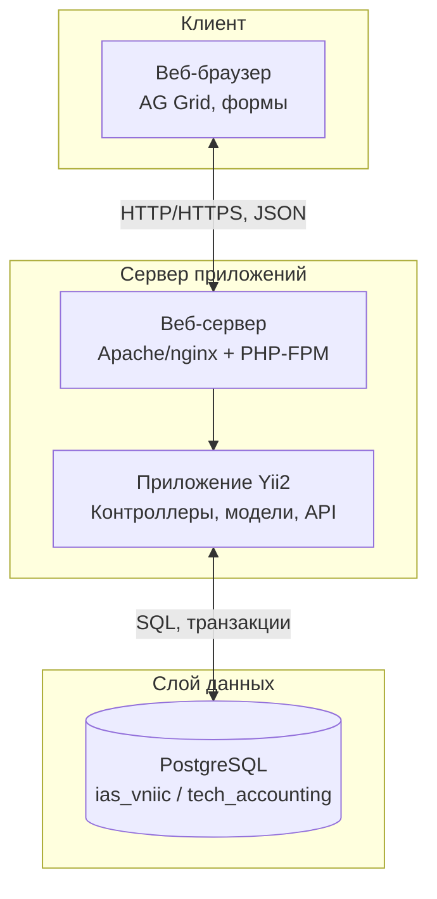
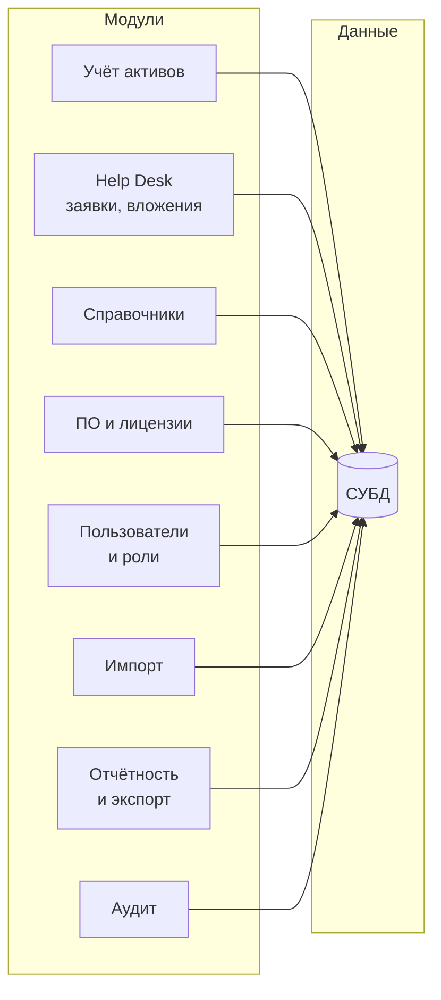
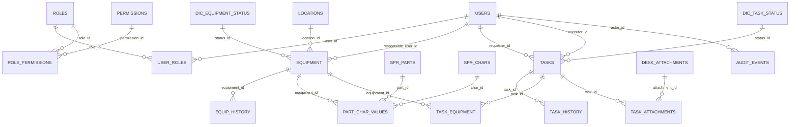

# Раздел 2. Архитектурное проектирование прототипа информационно-аналитической системы учёта технических средств предприятия

Документ подготовлен в соответствии с планом ВКР по теме «Проектирование и разработка прототипа информационно-аналитической системы учёта технических средств предприятия». Раздел охватывает подпункты 2.1–2.4 плана работы и предназначен для включения во вторую главу выпускной квалификационной работы.

---

## 2.1. Выбор и обоснование архитектурного стиля

Архитектура прототипа ИАС строится на основе многослойной клиент-серверной модели с явным разделением на уровень представления (фронтенд), уровень прикладной логики (сервер приложений) и уровень данных (СУБД). Данный выбор обусловлен требованиями к учёту активов, заявкам, разграничению доступа и аудиту, а также необходимостью интеграции с существующим веб-интерфейсом предприятия.

### 2.1.1. Многослойная клиент-серверная архитектура

**Слой представления (фронтенд).** Пользователи взаимодействуют с системой через веб-браузер. Фронтенд реализует страницы списков и карточек, формы ввода и редактирования, табличные представления данных. В рамках прототипа используется веб-клиент на базе существующего приложения с табличными представлениями и компонентом AG Grid для отображения списков заявок, активов, пользователей и журнала аудита. Размещение фронтенда на стороне клиента (браузер) обеспечивает единообразие интерфейса и снижает нагрузку на сервер при отрисовке и фильтрации больших наборов данных в режиме клиентской пагинации.

**Слой приложений (сервер приложений).** Бизнес-логика и прикладные интерфейсы (API) размещаются на сервере. Сервер приложений обрабатывает запросы пользователей, проверяет права доступа, выполняет операции над данными (создание, изменение, удаление, выборки), формирует ответы в формате JSON для гридов и форм, обеспечивает фиксацию операций в журнале аудита. Вынесение логики на сервер гарантирует централизованную проверку прав и целостность данных независимо от типа клиента.

**Слой данных (СУБД).** Хранение данных выполняется в реляционной СУБД. Выбор реляционной модели обусловлен структурой предметной области (сущности с однозначными связями, справочники, история изменений), требованиями к ссылочной целостности и к транзакционности операций. СУБД обеспечивает индексацию для быстрого поиска и фильтрации, поддержку ограничений целостности и при необходимости — триггеры (например, запрет изменения и удаления записей журнала аудита).

Обобщённая схема слоёв представлена на рисунке 1.

**Рисунок 1 — Многослойная клиент-серверная архитектура прототипа ИАС** *(рекомендуется разместить после п. 2.1.1)*

### 2.1.2. Учёт требований к интеграции с существующим фронтендом

В условиях эксплуатации на предприятии прототип должен интегрироваться с уже используемым веб-интерфейсом. Ключевые аспекты:

- **Совместимость с AG Grid.** Списки заявок, активов, пользователей и журнал аудита отображаются в табличном виде. Серверная часть предоставляет данные в формате, ожидаемом гридом (массив записей, единообразные имена полей, типы данных). Контракт API (эндпоинты get-grid-data и структура ответа) фиксируется в спецификации интерфейсов. При необходимости вводится режим серверной пагинации и сортировки для больших объёмов данных с передачей параметров page, pageSize, sort, filter в запросе.

- **Единая точка входа и аутентификация.** Доступ к приложению осуществляется через общий веб-сервер (например, Apache или nginx с PHP-FPM). Аутентификация пользователей выполняется до предоставления доступа к страницам и API; сессия связывается с учётной записью и ролями для последующей проверки прав на серверной стороне.

### 2.1.3. Разграничение доступа и аудит в рамках выбранного стека

Требования к разграничению доступа и аудиту (раздел 1.5 и техническое задание) реализуются в рамках выбранного технологического стека:

- **Проверка прав на серверной стороне.** Каждый запрос к API (смена статуса заявки, назначение исполнителя, редактирование карточки актива, скачивание вложения и т.д.) обрабатывается только после проверки прав текущего пользователя. Проверка выполняется в контроллерах или сервисах приложения; доступ к данным ограничивается по ролям (пользователь, оператор, администратор) и по правилам (например, доступ к карточке актива — администратор или ответственный за актив).

- **Журнал аудита.** Критичные операции (управление пользователями и ролями, изменения заявок и вложений, изменения карточек активов) регистрируются в таблице журнала аудита с фиксацией даты/времени, пользователя, типа операции, объекта и результата. Записи журнала не изменяются и не удаляются в рамках штатной модели доступа; при необходимости неизменяемость обеспечивается на уровне СУБД (триггеры запрета UPDATE/DELETE).

### 2.1.4. Обоснование выбора стека PHP/Yii2, PostgreSQL

**Сервер приложений: PHP, фреймворк Yii2.** Выбор обусловлен наличием существующей кодовой базы и веб-интерфейса на данном стеке на предприятии. Yii2 обеспечивает структуру MVC, встроенную поддержку RBAC (роли и разрешения), работу с формами и валидацией, интеграцию с СУБД через ActiveRecord, а также механизмы фильтрации доступа (access control) в контроллерах. Развитие прототипа в рамках того же стека минимизирует затраты на интеграцию и обучение персонала.

**СУБД: PostgreSQL.** Выбор обусловлен требованиями к надёжности хранения данных, поддержке транзакций, индексации и сложных запросов (связи заявок с активами, история, справочники). PostgreSQL обеспечивает кодировку UTF-8, типы данных TIMESTAMPTZ и JSONB для полей истории и метаданных, возможность реализации триггеров для защиты журнала аудита. Использование одной СУБД для всего прототипа упрощает развёртывание и резервное копирование.

Итог: многослойная клиент-серверная архитектура с разделением на фронтенд (веб-интерфейс), сервер приложений (бизнес-логика и API) и слой данных (PostgreSQL) в сочетании со стеком PHP/Yii2 обеспечивает выполнение функциональных и нефункциональных требований к прототипу и интеграцию с существующим фронтендом предприятия.

---

## 2.2. Проектирование компонентной структуры системы

Компонентная структура прототипа отражает функциональные контуры, определённые в разделе 1: учёт активов, Help Desk (заявки и вложения), справочники, учёт ПО и лицензий, управление пользователями и ролями, импорт/миграция, отчётность и экспорт, аудит.

### 2.2.1. Ключевые модули (компоненты)

| Модуль | Назначение | Основные функции |
|--------|------------|-------------------|
| Контур учёта активов | Карточки активов, характеристики, история событий | Регистрация и редактирование карточек активов; привязка к локации и ответственному; ведение характеристик (составные части — значения); история перемещений, закрепления, ремонтов, списания; архивирование. |
| Контур Help Desk | Заявки, статусы, исполнители, вложения | Регистрация заявок; смена статуса; назначение/снятие исполнителя; комментарии; привязка заявки к активам; загрузка, хранение метаданных, скачивание и предпросмотр вложений; история изменений заявки. |
| Контур справочников | Нормативно-справочная информация | Ведение справочников: типы активов, локации, статусы заявок, статусы оборудования, составные части и характеристики; контроль целостности ссылок; архивирование значений при наличии ссылок. |
| Контур учёта ПО и лицензий | Программное обеспечение и лицензии | Хранение сведений о ПО, сроках действия лицензий, связях «актив — установленное ПО»; отчётность и уведомления об истечении сроков (в рамках развития прототипа). |
| Модуль управления пользователями и ролями | Учётные записи и доступ | Создание, изменение, блокирование пользователей; назначение ролей; ведение справочника ролей и разрешений; аутентификация; проверка прав при доступе к операциям и данным. |
| Модуль импорта/миграции | Начальное наполнение и пополнение данных | Загрузка данных из согласованных форматов (CSV, JSON, XML, XLSX); сопоставление полей; обновление или вставка записей с учётом правил идемпотентности; формирование протокола импорта (обработано, ошибки). |
| Модуль отчётности и экспорта | Отчёты и выгрузки | Формирование отчётов по заявкам и активам по утверждённому перечню; статистика по пользователям, исполнителям, статусам, периодам; экспорт в согласованные форматы (Excel, PDF и т.д.) с учётом прав доступа. |
| Модуль аудита | Журналирование действий | Регистрация событий по операциям над пользователями, заявками, вложениями, активами; хранение атрибутов события (время, пользователь, тип операции, объект, результат); предоставление данных для просмотра и фильтрации журнала (доступ только уполномоченным ролям). |

Взаимодействие модулей с слоем данных и с клиентом показано на рисунке 2.

**Рисунок 2 — Компонентная структура прототипа ИАС** *(рекомендуется разместить после п. 2.2.1)*

### 2.2.2. Диаграмма развёртывания

С точки зрения развёртывания прототип предполагает следующие узлы:

- **Узел клиента:** веб-браузер пользователя; запросы к приложению по HTTP/HTTPS.
- **Узел веб-сервера/сервера приложений:** веб-сервер (Apache/nginx), интерпретатор PHP (PHP-FPM), приложение на Yii2 (контроллеры, модели, представления, сервисы). Обработка запросов, проверка прав, вызовы к БД.
- **Узел СУБД:** сервер PostgreSQL с базой данных прототипа (схема tech_accounting). Хранение данных, выполнение запросов, триггеры.

В типовой конфигурации веб-сервер и приложение могут размещаться на одном физическом или виртуальном сервере, СУБД — на том же или отдельном сервере в зависимости от требований к производительности и эксплуатации. Схема развёртывания приведена на рисунке 3.

**Рисунок 3 — Схема развёртывания прототипа** *(рекомендуется разместить после п. 2.2.2)*

---

## 2.3. Проектирование логической модели базы данных

Логическая и физическая модели данных прототипа разрабатываются с учётом сущностей предметной области (раздел 1.2), требований к связям, истории изменений и аудиту.

### 2.3.1. Логические контуры и сущности

Модель данных разбита на логические контуры:

**Контур управления доступом (RBAC).** Роли (`roles`), разрешения (`permissions`), связки роль–разрешение (`role_permissions`), пользователи (`users`), связки пользователь–роль (`user_roles`).

**Контур нормативно-справочной информации.** Локации (`locations`), справочники статусов заявок (`dic_task_status`) и статусов оборудования (`dic_equipment_status`), составные части и характеристики (`spr_parts`, `spr_chars`), при необходимости — журнал изменений справочников (`nsi_change_log`).

**Контур учёта активов.** Оборудование/активы (`equipment`): атрибуты — инвентарный номер, серийный номер, наименование, тип, марка/модель, ссылки на локацию, ответственного пользователя, статус, даты поступления и гарантии, признаки архивирования и удаления. История событий актива (`equip_history`): дата/время, пользователь, тип события, описание. Значения характеристик активов (`part_char_values`): связь актив — составная часть — характеристика — значение по справочникам.

**Контур заявок Help Desk.** Заявки (`tasks`): автор (requester_id), исполнитель (executor_id), статус, описание, комментарий, даты создания и обновления. История изменений заявки (`task_history`): фиксация смены статуса, исполнителя и ключевых полей. Связь заявка — актив многие ко многим (`task_equipment`): одна заявка может относиться к нескольким активам; по активу доступен список связанных заявок.

**Контур вложений.** Метаданные вложений (`desk_attachments`): имя файла, тип, размер, дата загрузки, пользователь. Связь заявка — вложение (`task_attachments`): нормализованная связь многие ко многим; файлы хранятся на диске или в хранилище с привязкой по идентификатору.

**Контур аудита и эксплуатации.** Журнал аудита (`audit_events`): время, пользователь (actor_id), тип операции, тип и идентификатор объекта, результат, при необходимости — технический контекст. Для обеспечения неизменяемости записей на уровне БД применяется триггер, запрещающий UPDATE и DELETE. Протокол импорта: таблицы `import_runs` (итоги загрузки), `import_errors` (ошибки по строкам).

### 2.3.2. Ключевые связи между сущностями

| Связь | Реализация |
|-------|-------------|
| Актив — пользователь (ответственный) | equipment.responsible_user_id → users.id |
| Актив — локация | equipment.location_id → locations.id |
| Актив — статус оборудования | equipment.status_id → dic_equipment_status.id |
| История событий актива | equip_history.equipment_id → equipment.id |
| Характеристики актива | part_char_values: equipment_id, part_id, char_id, значение; ссылки на spr_parts, spr_chars |
| Заявка — автор, исполнитель | tasks.requester_id, tasks.executor_id → users.id |
| Заявка — статус | tasks.status_id → dic_task_status.id |
| Заявка — актив (M:N) | task_equipment.task_id → tasks.id, task_equipment.equipment_id → equipment.id |
| Заявка — вложение (M:N) | task_attachments.task_id → tasks.id, task_attachments.attachment_id → desk_attachments.id |
| История заявки | task_history.task_id → tasks.id |
| Аудит — пользователь | audit_events.actor_id → users.id |

Поддержка связей актив — пользователь, актив — локация, заявка — актив, заявка — вложение, а также хранение истории изменений и событий жизненного цикла актива обеспечивает выполнение требований раздела 1.5 и технического задания.

### 2.3.3. Физическая модель: платформа и правила

- **Платформа:** СУБД PostgreSQL; база данных `ias_vniic`; схема `tech_accounting`; кодировка UTF-8.
- **Ключи:** первичные ключи — BIGSERIAL; внешние ключи — BIGINT с REFERENCES.
- **Временные атрибуты:** системные даты — TIMESTAMPTZ; бизнес-даты (поступление, гарантия) — DATE.
- **Структурированные поля:** для старых/новых значений и метаданных при необходимости используется тип JSONB.
- **Мягкое удаление и архив:** поля is_deleted, is_archived, archived_at для сохранения истории и исключения записей из актуального набора.
- **Индексация:** индексы по инвентарному и серийному номеру, по статусу и локации, по датам создания заявок и активов, по полям журнала аудита (время, пользователь, тип объекта) для обеспечения целевых показателей производительности (раздел 1.5).

Логическая структура сущностей и связей отражена на рисунке 4.

**Рисунок 4 — Логическая модель данных (ключевые сущности и связи)** *(рекомендуется разместить после п. 2.3.3)*

---

## 2.4. Проектирование пользовательского интерфейса (UI/UX)

Проектирование интерфейса охватывает экраны и сценарии работы пользователей по всем контурам системы: учёт активов, карточка пользователя, заявки Help Desk, поиск и фильтрация, отчётность, журнал аудита, управление пользователями и справочниками.

### 2.4.1. Интерфейсы контура учёта активов

**Список активов (оборудования).** Страница с табличным представлением (AG Grid) перечня активов. Колонки: инвентарный номер, серийный номер, наименование/тип, марка/модель, локация, ответственный, статус, дата поступления. Доступ к списку — в соответствии с ролевой моделью (например, только администратор). Поддержка фильтрации по локации, статусу, ответственному и поиска по инвентарному/серийному номеру. Переход к карточке актива по выбору строки или по ссылке.

**Создание и редактирование карточки актива.** Форма с полями: тип актива (из справочника), инвентарный номер (или учётная пометка), серийный номер, марка, модель, локация, ответственный, даты (приобретения, ввода в эксплуатацию, гарантийный срок), эксплуатационный статус. Блок технических характеристик: выбор составной части и характеристики из справочников, ввод значения (повтор для нескольких пар). Валидация уникальности инвентарного номера. Кнопки сохранения и отмены. Доступ на редактирование — администратор или ответственный за актив (по регламенту).

**Просмотр карточки актива.** Отображение всех атрибутов актива в режиме чтения; раздел истории событий (перемещения, закрепление/снятие, ремонты, списание); список связанных заявок (в пределах прав доступа). Возможность перехода к редактированию при наличии прав и к архивированию (только уполномоченные роли).

### 2.4.2. Карточка пользователя (закреплённое оборудование)

**Просмотр карточки пользователя.** Страница или панель с отображением перечня активов, закреплённых за выбранным пользователем. Группировка по типу техники (ПК, монитор, принтер, ИБП и т.д.). Краткие атрибуты каждого актива (инв. номер, наименование, локация) для контекста. Данные формируются по связи «актив — ответственный»; доступ — в соответствии с правами (пользователь видит только свою технику; оператор/администратор — технику любого пользователя, в том числе для контекста заявки).

### 2.4.3. Интерфейсы контура Help Desk (заявки)

**Список заявок.** Страница с табличным представлением (AG Grid). Колонки: идентификатор, описание (или краткое), статус, автор, исполнитель, дата создания, дата обновления. Видимость записей по ролям: пользователь — только свои заявки и заявки, где он исполнитель; оператор и администратор — все заявки. Фильтрация по статусу, автору, исполнителю, периоду. Поиск по тексту описания. Переход к деталям заявки по выбору строки.

**Детали заявки.** Отображение полного описания, статуса, автора, исполнителя, дат, списка связанных активов (с возможностью перехода к карточке актива). Блок комментариев с указанием автора и даты/времени. Список вложений с возможностью скачивания и предпросмотра (в пределах разрешённых типов и прав). Элементы управления: смена статуса, назначение/снятие исполнителя, редактирование комментария — при наличии прав. Загрузка новых вложений при создании или редактировании заявки.

**Создание заявки.** Форма с полями: описание (обязательное), при необходимости — выбор связанных активов из перечня техники пользователя или из общего списка (по правам), загрузка файлов вложений. После сохранения — переход к деталям заявки или к списку.

### 2.4.4. Поиск и фильтрация по активам и заявкам

**Расширенный поиск и фильтрация.** Для списка активов: фильтры по локации, статусу, ответственному, типу актива; поиск по инвентарному номеру, серийному номеру, наименованию. Для списка заявок: фильтры по статусу, автору, исполнителю, периоду создания/обновления; текстовый поиск по описанию. Параметры фильтрации передаются в API и учитываются при формировании выборки (при серверной пагинации — в составе запроса к БД). Результаты отображаются в таблице с возможностью сортировки по колонкам.

### 2.4.5. Отчётность и журнал аудита

**Просмотр отчётов.** Отдельная страница или раздел с перечнем доступных отчётов (по заявкам, по активам, по пользователям, по исполнителям, по статусам и периодам). Выбор параметров отчёта (период, фильтры); формирование отчёта на сервере; отображение результата в табличном виде или в виде сводки. Экспорт в согласованные форматы (Excel, PDF) с учётом прав доступа.

**Журнал аудита.** Страница с табличным представлением (AG Grid) записей журнала аудита. Колонки: дата/время, пользователь, тип операции, тип объекта, идентификатор объекта, результат. Фильтрация по периоду, пользователю, типу операции, типу объекта. Доступ только уполномоченным ролям (администратор).

### 2.4.6. Управление пользователями и справочниками

**Управление пользователями.** Список учётных записей с возможностью создания, редактирования, блокирования/разблокирования. Назначение и снятие ролей. Доступ — только администратор.

**Управление справочниками.** Интерфейсы ведения справочников: типы активов, локации, статусы заявок, статусы оборудования, составные части и характеристики. Создание, редактирование, архивирование значений при наличии ссылок. Контроль целостности при удалении или архивировании. Доступ — уполномоченные роли (как правило, администратор).

Описанные интерфейсы обеспечивают полноту сценариев работы пользователей в соответствии с функциональными требованиями раздела 1.5 и готовы к реализации в рамках раздела 3 (реализация и тестирование прототипа).

---

## Рекомендуемые иллюстрации для раздела 2

Ниже приведены подписи к рисункам и исходный код диаграмм в формате Mermaid для включения в главу 2 ВКР. Диаграммы можно отобразить в среде, поддерживающей Mermaid, или экспортировать в PNG/SVG для вставки в итоговый документ.

### Рисунок 1 — Многослойная клиент-серверная архитектура прототипа ИАС



### Рисунок 2 — Компонентная структура прототипа ИАС



### Рисунок 3 — Схема развёртывания прототипа

```mermaid
deploymentDiagram
  node "Сервер приложений" {
    artifact "Веб-сервер\n(PHP-FPM, Yii2)"
  }
  node "Сервер БД" {
    artifact "PostgreSQL\nias_vniic"
  }
  node "Клиент" {
    artifact "Браузер"
  }
  "Клиент" --> "Сервер приложений" : HTTP/HTTPS
  "Сервер приложений" --> "Сервер БД" : TCP/5432
```

*Примечание.* В типовой конфигурации «Сервер приложений» и «Сервер БД» могут размещаться на одном узле.

### Рисунок 4 — Логическая модель данных (ключевые сущности и связи)



---

*Документ подготовлен для включения в Главу 2 ВКР. При оформлении по ГОСТ: вставить рисунки в указанные места по тексту, добавить ссылки на список источников. Диаграммы Mermaid при необходимости экспортировать в PNG/SVG для вставки в итоговый файл ВКР (Word, PDF).*
