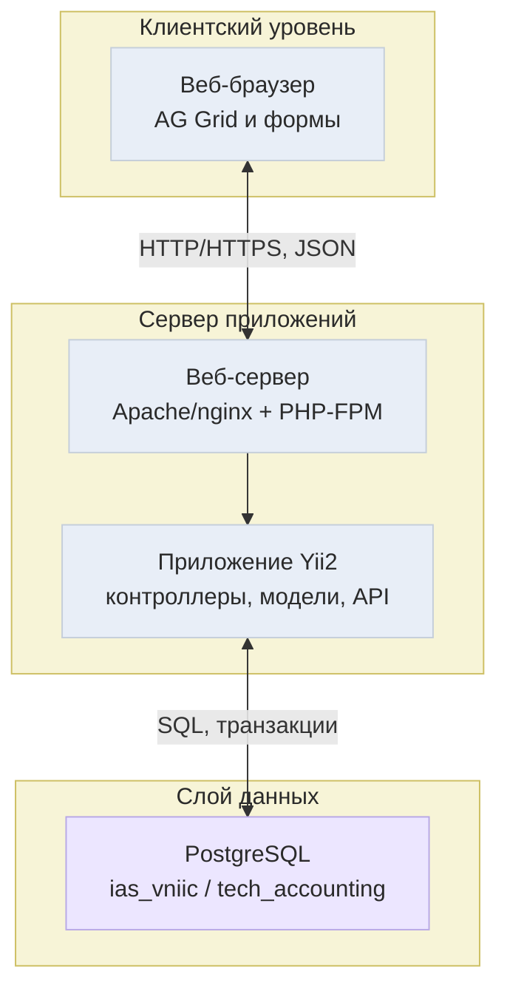
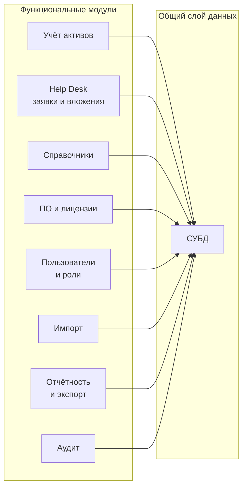
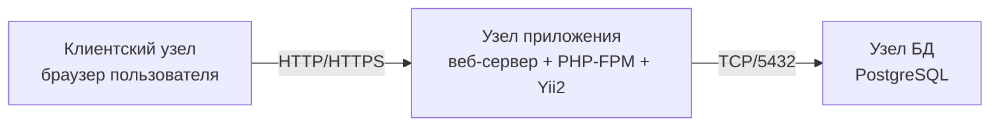
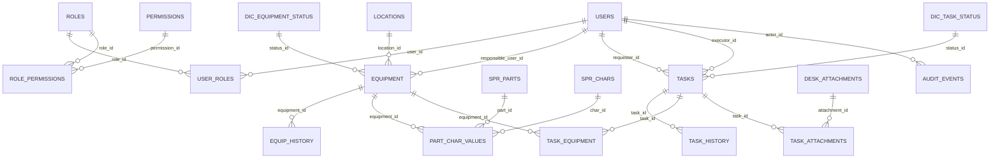
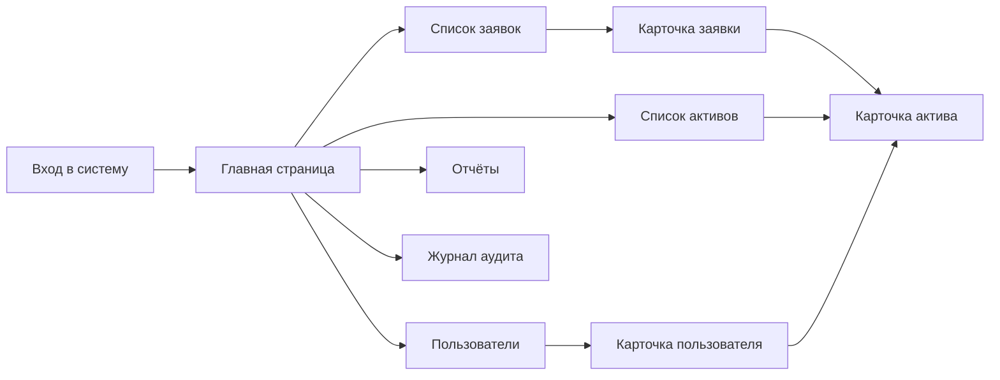

# Раздел 2. Проектный раздел

## 2.1. Выбор и обоснование архитектурного стиля

### 2.1.1. Многослойная клиент-серверная архитектура

Обобщённая схема слоёв представлена на рисунке 2.1.

**Рисунок 2.1 — Многослойная клиент-серверная архитектура прототипа ИАС**

### 2.1.2. Требования к веб-клиенту и размещению приложения

Прототип развёртывается как автономная информационная система. Доступ к страницам и API предоставляется только после аутентификации.

### 2.1.3. Разграничение доступа и аудит в рамках выбранного стека

Проверка прав выполняется на серверной стороне для каждого запроса. Критичные операции регистрируются в журнале аудита.

### 2.1.4. Обоснование выбора стека PHP/Yii2, PostgreSQL

Выбран стек PHP/Yii2 и PostgreSQL, обеспечивающий реализацию ролевой модели доступа, транзакционности и индексации данных.

**Таблица 2.1 — Сопоставление архитектурных вариантов для прототипа ИАС**

| Вариант | Преимущества | Ограничения | Оценка применимости |
|---------|--------------|-------------|---------------------|
| Монолитное веб-приложение без явного разделения слоёв | Простота начальной реализации и развёртывания | Слабая управляемость ростом функциональности | Ограниченно применим |
| Микросервисная архитектура | Гибкое масштабирование отдельных сервисов | Высокая сложность инфраструктуры | Избыточна |
| Многослойная клиент-серверная архитектура | Баланс структурности и расширяемости | Требует дисциплины разделения ответственности | Оптимальна |

## 2.2. Проектирование компонентной структуры системы

### 2.2.1. Ключевые модули (компоненты)

Ниже приведён перечень **логических компонентов** (функциональных контуров) прототипа ИАС. Состав компонентов согласован с требованиями раздела 1; взаимосвязь контуров и единый доступ к данным на концептуальном уровне показаны на рисунке 2.2.

| Модуль | Назначение | Основные функции |
|--------|------------|------------------|
| Контур учёта активов | Карточки активов, характеристики, история событий | Регистрация и редактирование карточек, история жизненного цикла |
| Контур Help Desk | Заявки, статусы, исполнители, вложения | Регистрация заявок, назначение исполнителя, смена статуса |
| Контур справочников | Нормативно-справочная информация | Ведение типов активов, локаций, статусов, характеристик |
| Контур учёта ПО и лицензий | Учёт ПО | Связи «актив — ПО», учёт сроков действия лицензий |
| Модуль управления пользователями и ролями | Учётные записи и доступ | Создание и блокирование пользователей, назначение ролей |
| Контур инвентаризации | Инвентаризационные сессии и позиции сверки | Запуск сверки по локации или подразделению; фиксация фактического наличия и расхождений; протокол; отражение результатов в истории актива и журнале аудита |
| Модуль импорта/миграции | Загрузка данных | Импорт CSV/JSON/XML/XLSX, протокол ошибок |
| Модуль отчётности и экспорта | Отчёты и выгрузки | Отчёты по заявкам и активам, экспорт |
| Модуль аудита | Журналирование действий | Регистрация событий и фильтрация журнала аудита |

**Рисунок 2.2 — Логические компоненты и контейнеры доступа к данным прототипа ИАС (фрагмент нотации C4)**

На рисунке 2.2 компоненты располагаются внутри **единого веб-приложения** (контейнер серверной части прототипа). Взаимодействие между компонентами выполняется в рамках одного процесса приложения посредством вызовов **контроллеров**, **моделей предметной области** и **общих компонентов** прикладной логики. Обмен с СУБД PostgreSQL осуществляется через **единый механизм подключения** к базе данных; запросы формируются в виде **SQL** и выполняются средствами драйвера **PDO (pgsql)**; рабочая схема данных — `tech_accounting`. Отдельный сетевой интерфейс «компонент — база данных» не предусматривается.

### 2.2.2. Диаграмма развёртывания

**Рисунок 2.3 — UML-диаграмма развёртывания прототипа**

## 2.3. Проектирование логической модели базы данных

### 2.3.1. Логические контуры и сущности

Модель данных разбита на контуры RBAC, НСИ, учёта активов, инвентаризации, Help Desk, вложений, аудита и эксплуатации.

### 2.3.2. Ключевые связи между сущностями

| Связь | Реализация |
|-------|------------|
| Актив — пользователь | `equipment.responsible_user_id -> users.id` |
| Актив — локация | `equipment.location_id -> locations.id` |
| Заявка — автор/исполнитель | `tasks.requester_id/executor_id -> users.id` |
| Заявка — актив (M:N) | `task_equipment.task_id/equipment_id` |
| Заявка — вложение (M:N) | `task_attachments.task_id/attachment_id` |
| Инвентаризация — позиции | `inventory_items.inventory_run_id -> inventory_runs.id` |

### 2.3.3. Физическая модель: платформа и правила

Платформа: PostgreSQL, схема `tech_accounting`, кодировка UTF-8, внешние ключи и индексация по ключевым поисковым полям.

**Рисунок 2.4 — Логическая модель данных (ключевые сущности и связи)**

### 2.3.4. Проектирование ключевых бизнес-процессов

**Рисунок 2.5 — Диаграмма процесса обработки заявки, связанной с техническим средством**

## 2.4. Проектирование пользовательского интерфейса (UI/UX)

### 2.4.1. Интерфейсы контура учёта активов

### 2.4.2. Карточка пользователя (закреплённое оборудование)

### 2.4.3. Интерфейсы контура Help Desk (заявки)

### 2.4.4. Поиск и фильтрация по активам и заявкам

### 2.4.5. Отчётность и журнал аудита

### 2.4.6. Управление пользователями и справочниками

**Рисунок 2.6 — Карта основных пользовательских экранов и переходов**

### 2.4.7. Интерфейсы инвентаризационной сверки

## 2.5. Проектирование подсистемы администрирования и разграничения доступа

**Рисунок 2.7 — Схема подсистемы администрирования и разграничения доступа**

## Вывод по разделу 2

Во второй главе выполнено архитектурное проектирование прототипа ИАС: обоснован архитектурный стиль, определены компоненты, логическая модель данных, ключевые процессы, пользовательские интерфейсы и подсистема администрирования.
# Раздел 2. Проектный раздел

## 2.1. Выбор и обоснование архитектурного стиля

Архитектура прототипа ИАС строится на основе многослойной клиент-серверной модели с явным разделением на уровень представления (фронтенд), уровень прикладной логики (сервер приложений) и уровень данных (СУБД).

### 2.1.1. Многослойная клиент-серверная архитектура

Обобщённая схема слоёв представлена на рисунке 2.1.

**Рисунок 2.1 — Многослойная клиент-серверная архитектура прототипа ИАС**

### 2.1.2. Требования к веб-клиенту и размещению приложения

Прототип развёртывается как автономная информационная система. Списки заявок, активов, пользователей и журнал аудита отображаются в табличном виде; доступ к страницам и API предоставляется только после аутентификации.

### 2.1.3. Разграничение доступа и аудит в рамках выбранного стека

Проверка прав выполняется на серверной стороне для каждого запроса. Критичные операции регистрируются в журнале аудита с фиксацией времени, пользователя, типа операции, объекта и результата.

### 2.1.4. Обоснование выбора стека PHP/Yii2, PostgreSQL

Выбран стек PHP/Yii2 и PostgreSQL, обеспечивающий реализацию MVC-подхода, ролевой модели доступа, транзакционности и индексации данных.

**Таблица 2.1 — Сопоставление архитектурных вариантов для прототипа ИАС**

| Вариант | Преимущества | Ограничения | Оценка применимости |
|---------|--------------|-------------|---------------------|
| Монолитное веб-приложение без явного разделения слоёв | Простота начальной реализации и развёртывания | Слабая управляемость ростом функциональности | Ограниченно применим |
| Микросервисная архитектура | Гибкое масштабирование отдельных сервисов | Высокая сложность инфраструктуры | Избыточна |
| Многослойная клиент-серверная архитектура | Баланс структурности и расширяемости | Требует дисциплины разделения ответственности | Оптимальна |

## 2.2. Проектирование компонентной структуры системы

### 2.2.1. Ключевые модули (компоненты)

Ниже приведён перечень **логических компонентов** (функциональных контуров) прототипа ИАС. Состав компонентов согласован с требованиями раздела 1; взаимосвязь контуров и единый доступ к данным на концептуальном уровне показаны на рисунке 2.2.

| Модуль | Назначение | Основные функции |
|--------|------------|------------------|
| Контур учёта активов | Карточки активов, характеристики, история событий | Регистрация и редактирование карточек, история жизненного цикла |
| Контур Help Desk | Заявки, статусы, исполнители, вложения | Регистрация заявок, назначение исполнителя, смена статуса |
| Контур справочников | Нормативно-справочная информация | Ведение типов активов, локаций, статусов, характеристик |
| Контур учёта ПО и лицензий | Учёт ПО | Связи «актив — ПО», учёт сроков действия лицензий |
| Модуль управления пользователями и ролями | Учётные записи и доступ | Создание и блокирование пользователей, назначение ролей |
| Контур инвентаризации | Инвентаризационные сессии и позиции сверки | Запуск сверки по локации или подразделению; фиксация фактического наличия и расхождений; протокол; отражение результатов в истории актива и журнале аудита |
| Модуль импорта/миграции | Загрузка данных | Импорт CSV/JSON/XML/XLSX, протокол ошибок |
| Модуль отчётности и экспорта | Отчёты и выгрузки | Отчёты по заявкам и активам, экспорт |
| Модуль аудита | Журналирование действий | Регистрация событий и фильтрация журнала аудита |

**Рисунок 2.2 — Логические компоненты и контейнеры доступа к данным прототипа ИАС (фрагмент нотации C4)**

На рисунке 2.2 компоненты располагаются внутри **единого веб-приложения** (контейнер серверной части прототипа). Взаимодействие между компонентами выполняется в рамках одного процесса приложения посредством вызовов **контроллеров**, **моделей предметной области** и **общих компонентов** прикладной логики. Обмен с СУБД PostgreSQL осуществляется через **единый механизм подключения** к базе данных; запросы формируются в виде **SQL** и выполняются средствами драйвера **PDO (pgsql)**; рабочая схема данных — `tech_accounting`. Отдельный сетевой интерфейс «компонент — база данных» не предусматривается.

### 2.2.2. Диаграмма развёртывания

Схема развёртывания прототипа приведена на рисунке 2.3.

**Рисунок 2.3 — UML-диаграмма развёртывания прототипа**

## 2.3. Проектирование логической модели базы данных

### 2.3.1. Логические контуры и сущности

Модель данных разбита на контуры RBAC, НСИ, учёта активов, инвентаризации, Help Desk, вложений, аудита и эксплуатации.

### 2.3.2. Ключевые связи между сущностями

| Связь | Реализация |
|-------|------------|
| Актив — пользователь | `equipment.responsible_user_id -> users.id` |
| Актив — локация | `equipment.location_id -> locations.id` |
| Заявка — автор/исполнитель | `tasks.requester_id/executor_id -> users.id` |
| Заявка — актив (M:N) | `task_equipment.task_id/equipment_id` |
| Заявка — вложение (M:N) | `task_attachments.task_id/attachment_id` |
| Инвентаризация — позиции | `inventory_items.inventory_run_id -> inventory_runs.id` |

### 2.3.3. Физическая модель: платформа и правила

Платформа: PostgreSQL, схема `tech_accounting`, кодировка UTF-8, внешние ключи и индексация по ключевым поисковым полям.

**Рисунок 2.4 — Логическая модель данных (ключевые сущности и связи)**

### 2.3.4. Проектирование ключевых бизнес-процессов

Выделяется сквозной процесс обработки заявки, связанной с техническим средством, а также процесс инвентаризационной сверки активов.

**Рисунок 2.5 — Диаграмма процесса обработки заявки, связанной с техническим средством**

## 2.4. Проектирование пользовательского интерфейса (UI/UX)

### 2.4.1. Интерфейсы контура учёта активов

Описываются список активов, карточка актива, история событий и связанные заявки.

### 2.4.2. Карточка пользователя (закреплённое оборудование)

Карточка пользователя отображает перечень закреплённых активов и краткие атрибуты.

### 2.4.3. Интерфейсы контура Help Desk (заявки)

Описываются список заявок, карточка заявки, создание заявки, комментарии, статусы и вложения.

### 2.4.4. Поиск и фильтрация по активам и заявкам

Описываются фильтры и поиск по активам и заявкам с передачей параметров в API.

### 2.4.5. Отчётность и журнал аудита

Описываются экран отчётности, параметры формирования отчётов, экспорт и экран журнала аудита.

### 2.4.6. Управление пользователями и справочниками

Описываются интерфейсы управления пользователями, ролями и справочниками.

**Рисунок 2.6 — Карта основных пользовательских экранов и переходов**

### 2.4.7. Интерфейсы инвентаризационной сверки

Предусматривается сценарий запуска инвентаризационной сверки с формированием ведомости, фиксацией расхождений и сохранением протокола проверки.

## 2.5. Проектирование подсистемы администрирования и разграничения доступа

Подсистема администрирования обеспечивает ведение учётных записей и ролей (RBAC), управление справочниками, импорт данных, просмотр журнала аудита и контроль доступа к операциям.

**Рисунок 2.7 — Схема подсистемы администрирования и разграничения доступа**

## Вывод по разделу 2

Во второй главе выполнено архитектурное проектирование прототипа ИАС: обоснован архитектурный стиль, определены компоненты, логическая модель данных, ключевые процессы, пользовательские интерфейсы и подсистема администрирования.
# Раздел 2. Проектный раздел

## 2.1. Выбор и обоснование архитектурного стиля

Архитектура прототипа ИАС строится на основе многослойной клиент-серверной модели с явным разделением на уровень представления (фронтенд), уровень прикладной логики (сервер приложений) и уровень данных (СУБД). Данный выбор обусловлен требованиями к учёту активов, заявкам, разграничению доступа и аудиту, а также необходимостью реализации прототипа как самостоятельной веб-ориентированной системы с собственным пользовательским интерфейсом.

### 2.1.1. Многослойная клиент-серверная архитектура

**Слой представления (фронтенд).** Пользователи взаимодействуют с системой через веб-браузер. Фронтенд реализует страницы списков и карточек, формы ввода и редактирования, табличные представления данных. В рамках прототипа веб-клиент использует компонент AG Grid для отображения списков заявок, активов, пользователей и журнала аудита.

**Слой приложений (сервер приложений).** Бизнес-логика и прикладные интерфейсы (API) размещаются на сервере. Сервер приложений обрабатывает запросы пользователей, проверяет права доступа, выполняет операции над данными, формирует ответы в формате JSON и обеспечивает фиксацию операций в журнале аудита.

**Слой данных (СУБД).** Хранение данных выполняется в реляционной СУБД с поддержкой транзакционности, ссылочной целостности и индексации.

Обобщённая схема слоёв представлена на рисунке 2.1.

**Рисунок 2.1 — Многослойная клиент-серверная архитектура прототипа ИАС**

### 2.1.2. Требования к веб-клиенту и размещению приложения

Прототип развёртывается как автономная информационная система. Ниже фиксируются требования к веб-клиенту и типовой схеме доступа пользователей:

- **Совместимость с AG Grid.** Списки заявок, активов, пользователей и журнал аудита отображаются в табличном виде. Серверная часть предоставляет данные в формате, ожидаемом гридом.
- **Единая точка входа и аутентификация.** Доступ к приложению осуществляется через веб-сервер (Apache или nginx с PHP-FPM). Аутентификация выполняется до предоставления доступа к страницам и API.

### 2.1.3. Разграничение доступа и аудит в рамках выбранного стека

Требования к разграничению доступа и аудиту реализуются в рамках выбранного технологического стека:

- **Проверка прав на серверной стороне.** Каждый запрос к API обрабатывается только после проверки прав текущего пользователя.
- **Журнал аудита.** Критичные операции регистрируются с фиксацией даты и времени, пользователя, типа операции, объекта и результата.

### 2.1.4. Обоснование выбора стека PHP/Yii2, PostgreSQL

**Сервер приложений: PHP, фреймворк Yii2.** Выбор обусловлен зрелостью экосистемы и наличием в Yii2 встроенных средств MVC, RBAC, валидации и фильтрации доступа.

**СУБД: PostgreSQL.** Выбор обусловлен требованиями к надёжности хранения данных, транзакционности, индексации и поддержке сложных запросов.

Для формального обоснования выбора архитектурного стиля приведено сравнение вариантов (таблица 2.1).

**Таблица 2.1 — Сопоставление архитектурных вариантов для прототипа ИАС**

| Вариант | Преимущества | Ограничения | Оценка применимости |
|---------|--------------|-------------|---------------------|
| Монолитное веб-приложение без явного разделения слоёв | Простота начальной реализации и развёртывания | Слабая управляемость ростом функциональности | Ограниченно применим |
| Микросервисная архитектура | Гибкое масштабирование отдельных сервисов | Высокая сложность инфраструктуры | Избыточна |
| Многослойная клиент-серверная архитектура | Баланс структурности и расширяемости | Требует дисциплины разделения ответственности | Оптимальна |

## 2.2. Проектирование компонентной структуры системы

Компонентная структура прототипа отражает функциональные контуры, определённые в разделе 1: учёт активов, инвентаризационная сверка активов, Help Desk, справочники, учёт ПО и лицензий, управление пользователями и ролями, импорт/миграция, отчётность и экспорт, аудит.

### 2.2.1. Ключевые модули (компоненты)

Ниже приведён перечень **логических компонентов** (функциональных контуров) прототипа ИАС. Состав компонентов согласован с требованиями раздела 1; взаимосвязь контуров и единый доступ к данным на концептуальном уровне показаны на рисунке 2.2.

| Модуль | Назначение | Основные функции |
|--------|------------|------------------|
| Контур учёта активов | Карточки активов, характеристики, история событий | Регистрация и редактирование карточек, история жизненного цикла, архивирование |
| Контур Help Desk | Заявки, статусы, исполнители, вложения | Регистрация заявок, назначение исполнителя, смена статуса, комментарии |
| Контур справочников | Нормативно-справочная информация | Ведение типов активов, локаций, статусов, характеристик |
| Контур учёта ПО и лицензий | Учёт ПО | Связи «актив — ПО», учёт сроков действия лицензий |
| Модуль управления пользователями и ролями | Учётные записи и доступ | Создание и блокирование пользователей, назначение ролей |
| Контур инвентаризации | Инвентаризационные сессии и позиции сверки | Запуск сверки по локации или подразделению; фиксация фактического наличия и расхождений; протокол; отражение результатов в истории актива и журнале аудита |
| Модуль импорта/миграции | Загрузка данных | Импорт CSV/JSON/XML/XLSX, протокол ошибок |
| Модуль отчётности и экспорта | Отчёты и выгрузки | Отчёты по заявкам и активам, экспорт |
| Модуль аудита | Журналирование действий | Регистрация событий и фильтрация журнала аудита |

**Рисунок 2.2 — Логические компоненты и контейнеры доступа к данным прототипа ИАС (фрагмент нотации C4)**

На рисунке 2.2 компоненты располагаются внутри **единого веб-приложения** (контейнер серверной части прототипа). Взаимодействие между компонентами выполняется в рамках одного процесса приложения посредством вызовов **контроллеров**, **моделей предметной области** и **общих компонентов** прикладной логики. Обмен с СУБД PostgreSQL осуществляется через **единый механизм подключения** к базе данных; запросы формируются в виде **SQL** и выполняются средствами драйвера **PDO (pgsql)**; рабочая схема данных — `tech_accounting`. Отдельный сетевой интерфейс «компонент — база данных» не предусматривается.

### 2.2.2. Диаграмма развёртывания

Схема развёртывания формируется в логике трёхуровневой архитектуры, принятой в п. 2.1.1: уровень представления, уровень приложений и уровень данных.

С точки зрения развёртывания прототип предполагает следующие узлы:

- **Узел клиента (уровень представления):** веб-браузер пользователя, доступ к приложению по HTTP/HTTPS.
- **Узел веб-сервера/сервера приложений (уровень приложений):** Apache/nginx, PHP-FPM, приложение на Yii2 (контроллеры, модели, представления, сервисы); обработка запросов, проверка прав, обращение к СУБД.
- **Узел СУБД (уровень данных):** PostgreSQL, схема `tech_accounting`; хранение данных, выполнение SQL-запросов и триггеров.
- **Административный узел:** рабочее место администратора, подключаемое к веб-узлу по внутреннему сетевому сегменту.

Веб-узел (Apache/nginx + PHP-FPM + Yii2), административный узел и узел СУБД размещаются во внутреннем контуре. Пользовательский клиентский узел рассматривается как внешний контур доступа.

Схема развёртывания приведена на рисунке 2.3.

**Рисунок 2.3 — UML-диаграмма развёртывания прототипа**

## 2.3. Проектирование логической модели базы данных

Логическая и физическая модели данных прототипа разрабатываются с учётом сущностей предметной области, требований к связям, истории изменений и аудиту.

### 2.3.1. Логические контуры и сущности

Выделение логических контуров выполняется для структурирования сущностей по функциональному назначению и обеспечения целостности проектной модели данных.

Модель данных разбита на логические контуры:

- **RBAC:** `roles`, `permissions`, `role_permissions`, `users`, `user_roles`.
- **НСИ:** `locations`, `dic_task_status`, `dic_equipment_status`, `spr_parts`, `spr_chars`.
- **Учёт активов:** `equipment`, `equip_history`, `part_char_values`.
- **Инвентаризация:** `inventory_runs`, `inventory_items`.
- **Help Desk:** `tasks`, `task_history`, `task_equipment`.
- **Вложения:** `desk_attachments`, `task_attachments`.
- **Аудит и эксплуатация:** `audit_events`, `import_runs`, `import_errors`.

### 2.3.2. Ключевые связи между сущностями

| Связь | Реализация |
|-------|------------|
| Актив — пользователь | `equipment.responsible_user_id -> users.id` |
| Актив — локация | `equipment.location_id -> locations.id` |
| Актив — статус | `equipment.status_id -> dic_equipment_status.id` |
| История актива | `equip_history.equipment_id -> equipment.id` |
| Заявка — автор/исполнитель | `tasks.requester_id/executor_id -> users.id` |
| Заявка — статус | `tasks.status_id -> dic_task_status.id` |
| Заявка — актив (M:N) | `task_equipment.task_id/equipment_id` |
| Заявка — вложение (M:N) | `task_attachments.task_id/attachment_id` |
| Инвентаризация — позиции | `inventory_items.inventory_run_id -> inventory_runs.id` |
| Позиция инвентаризации — актив | `inventory_items.equipment_id -> equipment.id` |

### 2.3.3. Логическая модель данных

Логическая модель данных отражает состав сущностей предметной области и связи между ними без детализации физической реализации на уровне конкретных типов данных СУБД.

В логической модели выделяются следующие ключевые группы сущностей:

- **Контур доступа (RBAC):** пользователи, роли, разрешения и связи назначения ролей.
- **Контур НСИ:** локации, статусы заявок, статусы оборудования, справочники составных частей и характеристик.
- **Контур учёта активов:** карточки активов, история событий по активу, значения характеристик.
- **Контур Help Desk:** заявки, история изменений заявок, связь заявок с активами, связь заявок с вложениями.
- **Контур инвентаризации:** инвентаризационные сессии и позиции сверки по активам.
- **Контур аудита и эксплуатации:** журнал аудита, журналы выполнения импорта и ошибок импорта.

Ниже приведена укрупнённая ER-схема логической модели данных (сущности и их кардинальные связи).

```text
Diagram: логическая модель данных (ER, укрупненная)
  [USERS] -> [USER_ROLES] -> [ROLES] -> [ROLE_PERMISSIONS] -> [PERMISSIONS]
  [USERS] -> [EQUIPMENT] <- [LOCATIONS], [DIC_EQUIPMENT_STATUS]
  [EQUIPMENT] -> [EQUIP_HISTORY], [PART_CHAR_VALUES] <- [SPR_PARTS], [SPR_CHARS]
  [TASKS] <- [USERS: автор/исполнитель], [DIC_TASK_STATUS]
  [TASKS] <-> [TASK_EQUIPMENT] <-> [EQUIPMENT]
  [TASKS] <-> [TASK_ATTACHMENTS] <-> [DESK_ATTACHMENTS]
  [INVENTORY_RUNS] -> [INVENTORY_ITEMS] -> [EQUIPMENT]
  [USERS] -> [AUDIT_EVENTS]
  [IMPORT_RUNS] -> [IMPORT_ERRORS]
```

Логическая структура сущностей и связей представлена на рисунке 2.4.

**Рисунок 2.4 — Логическая модель данных (ключевые сущности и связи)**

### 2.3.4. Проектирование ключевых бизнес-процессов

В прототипе ИАС выделяется сквозной процесс обработки заявки, связанной с техническим средством: создание заявки, назначение исполнителя, смена статусов, работа с вложениями и комментариями, фиксация истории изменений и событий аудита.

Дополнительно в проектной модели выделяется процесс инвентаризационной сверки: формирование ведомости, фиксация фактического наличия и состояния активов, регистрация расхождений и сохранение протокола проверки.

**Рисунок 2.5 — Диаграмма процесса обработки заявки, связанной с техническим средством**

## 2.4. Проектирование пользовательского интерфейса (UI/UX)

### 2.4.1. Интерфейсы контура учёта активов

Описываются экран списка активов, карточка актива, сценарии создания и редактирования, просмотр истории и связанных заявок.

### 2.4.2. Карточка пользователя (закреплённое оборудование)

Карточка пользователя отображает перечень закреплённых активов и краткие атрибуты для операционного контекста.

### 2.4.3. Интерфейсы контура Help Desk (заявки)

Описываются список заявок, карточка заявки, создание заявки, работа с комментариями, статусами, исполнителем и вложениями.

### 2.4.4. Поиск и фильтрация по активам и заявкам

Описываются фильтры и поиск по активам и заявкам с передачей параметров в API.

### 2.4.5. Отчётность и журнал аудита

Описываются экран отчётности, параметры формирования отчётов, экспорт и экран журнала аудита.

### 2.4.6. Управление пользователями и справочниками

Описываются интерфейсы управления пользователями, ролями и справочниками для уполномоченных ролей.

**Рисунок 2.6 — Карта основных пользовательских экранов и переходов**

### 2.4.7. Интерфейсы инвентаризационной сверки

Для уполномоченных ролей предусматривается сценарий запуска инвентаризационной сверки с выбором локации или подразделения, основания и ответственного. Интерфейс сверки содержит табличный перечень активов с возможностью фиксации фактического наличия, фактического статуса и комментария по расхождениям. По завершении формируется протокол инвентаризации, а результаты автоматически отражаются в истории актива и журнале аудита.

## 2.5. Проектирование подсистемы администрирования и разграничения доступа

Подсистема администрирования реализует централизованное разграничение прав на основе ролевой модели (RBAC), в которой каждая операция интерфейса и API проверяется по назначенным роли разрешениям. В рамках подсистемы обеспечиваются ведение учётных записей и ролей, управление нормативно-справочной информацией, выполнение импорта с протоколированием, просмотр журнала аудита и формирование отчётов.

Распределение функций по ролям в прототипе задаётся следующим образом:

- **Пользователь:** создание и просмотр собственных заявок, отслеживание статусов и комментариев в пределах своих обращений.
- **Оператор:** обработка заявок (назначение, перевод по статусам, комментарии), проведение инвентаризационной сверки, просмотр операционных журналов в пределах полномочий.
- **Администратор:** полный контур администрирования (управление пользователями, ролями и матрицей прав, справочниками, настройками инвентаризации, импортом, аудитом и отчётностью).

Матрица разграничения доступа по ключевым операциям приведена на рисунке 2.8; структура матрицы согласована с шаблоном страницы «Управление ролями».

**Рисунок 2.7 — Схема подсистемы администрирования и разграничения доступа**

**Рисунок 2.8 — Матрица доступа ролей по ключевым операциям подсистемы администрирования**

## Вывод по разделу 2

Во второй главе выполнено архитектурное проектирование прототипа информационно-аналитической системы учёта технических средств предприятия. На основании требований первой главы обоснован выбор многослойной клиент-серверной архитектуры, определены ключевые модули системы, сформирована логическая модель данных, описаны ключевые бизнес-процессы, основные пользовательские интерфейсы и подсистема администрирования.
# Раздел 2. Архитектурное проектирование прототипа информационно-аналитической системы учёта технических средств предприятия

Документ подготовлен в соответствии с планом ВКР по теме «Проектирование и разработка прототипа информационно-аналитической системы учёта технических средств предприятия». Раздел охватывает подпункты 2.1–2.4 плана работы и предназначен для включения во вторую главу выпускной квалификационной работы.

Во второй главе архитектурные решения трассируются к аналитическим результатам раздела 1, включая: понятийную иерархию предметной области, требования к инвентаризации активов и ограничение области прототипа (без внедрения отдельного модуля телеметрического мониторинга на текущем этапе).

---

## 2.1. Выбор и обоснование архитектурного стиля

Архитектура прототипа ИАС строится на основе многослойной клиент-серверной модели с явным разделением на уровень представления (фронтенд), уровень прикладной логики (сервер приложений) и уровень данных (СУБД). Данный выбор обусловлен требованиями к учёту активов, заявкам, разграничению доступа и аудиту, а также необходимостью реализации прототипа как самостоятельной веб-ориентированной системы с собственным пользовательским интерфейсом; интеграция с иными корпоративными веб-приложениями предприятия в объёме настоящей работы не предусматривается.

### 2.1.1. Многослойная клиент-серверная архитектура

**Слой представления (фронтенд).** Пользователи взаимодействуют с системой через веб-браузер. Фронтенд реализует страницы списков и карточек, формы ввода и редактирования, табличные представления данных. В рамках прототипа веб-клиент разрабатывается в составе отдельного приложения и использует табличные представления и компонент AG Grid для отображения списков заявок, активов, пользователей и журнала аудита. Размещение фронтенда на стороне клиента (браузер) обеспечивает единообразие интерфейса и снижает нагрузку на сервер при отрисовке и фильтрации больших наборов данных в режиме клиентской пагинации.

**Слой приложений (сервер приложений).** Бизнес-логика и прикладные интерфейсы (API) размещаются на сервере. Сервер приложений обрабатывает запросы пользователей, проверяет права доступа, выполняет операции над данными (создание, изменение, удаление, выборки), формирует ответы в формате JSON для гридов и форм, обеспечивает фиксацию операций в журнале аудита. Вынесение логики на сервер гарантирует централизованную проверку прав и целостность данных независимо от типа клиента.

**Слой данных (СУБД).** Хранение данных выполняется в реляционной СУБД. Выбор реляционной модели обусловлен структурой предметной области (сущности с однозначными связями, справочники, история изменений), требованиями к ссылочной целостности и к транзакционности операций. СУБД обеспечивает индексацию для быстрого поиска и фильтрации, поддержку ограничений целостности и при необходимости — триггеры (например, запрет изменения и удаления записей журнала аудита).

Обобщённая схема слоёв представлена на рисунке 1.

**Рисунок 1 — Многослойная клиент-серверная архитектура прототипа ИАС** *(рекомендуется разместить после п. 2.1.1; нотация UML Component/Deployment, логический уровень)*

### 2.1.2. Требования к веб-клиенту и размещению приложения

Прототип развёртывается как автономная информационная система и не встраивается в уже используемые на предприятии веб-приложения. Ниже фиксируются требования к собственному веб-клиенту и к типовой схеме доступа пользователей:

- **Совместимость с AG Grid.** Списки заявок, активов, пользователей и журнал аудита отображаются в табличном виде. Серверная часть предоставляет данные в формате, ожидаемом гридом (массив записей, единообразные имена полей, типы данных). Контракт API (эндпоинты get-grid-data и структура ответа) фиксируется в спецификации интерфейсов. При необходимости вводится режим серверной пагинации и сортировки для больших объёмов данных с передачей параметров page, pageSize, sort, filter в запросе.

- **Единая точка входа и аутентификация.** Доступ к приложению осуществляется через общий веб-сервер (например, Apache или nginx с PHP-FPM). Аутентификация пользователей выполняется до предоставления доступа к страницам и API; сессия связывается с учётной записью и ролями для последующей проверки прав на серверной стороне.

### 2.1.3. Разграничение доступа и аудит в рамках выбранного стека

Требования к разграничению доступа и аудиту (раздел 1.5 и техническое задание) реализуются в рамках выбранного технологического стека:

- **Проверка прав на серверной стороне.** Каждый запрос к API (смена статуса заявки, назначение исполнителя, редактирование карточки актива, скачивание вложения и т.д.) обрабатывается только после проверки прав текущего пользователя. Проверка выполняется в контроллерах или сервисах приложения; доступ к данным ограничивается по ролям (пользователь, оператор, администратор) и по правилам (например, доступ к карточке актива — администратор или ответственный за актив).

- **Журнал аудита.** Критичные операции (управление пользователями и ролями, изменения заявок и вложений, изменения карточек активов) регистрируются в таблице журнала аудита с фиксацией даты/времени, пользователя, типа операции, объекта и результата. Записи журнала не изменяются и не удаляются в рамках штатной модели доступа; при необходимости неизменяемость обеспечивается на уровне СУБД (триггеры запрета UPDATE/DELETE).

### 2.1.4. Обоснование выбора стека PHP/Yii2, PostgreSQL

**Сервер приложений: PHP, фреймворк Yii2.** Выбор обусловлен зрелостью экосистемы PHP для корпоративных веб-приложений, наличием в Yii2 встроенных средств MVC, RBAC (роли и разрешения), работы с формами и валидацией, связи с СУБД через ActiveRecord, а также механизмов фильтрации доступа (access control) в контроллерах. Указанный стек снижает трудоёмкость реализации прототипа как отдельного приложения и упрощает его сопровождение.

**СУБД: PostgreSQL.** Выбор обусловлен требованиями к надёжности хранения данных, поддержке транзакций, индексации и сложных запросов (связи заявок с активами, история, справочники). PostgreSQL обеспечивает кодировку UTF-8, типы данных TIMESTAMPTZ и JSONB для полей истории и метаданных, возможность реализации триггеров для защиты журнала аудита. Использование одной СУБД для всего прототипа упрощает развёртывание и резервное копирование.

Для формального обоснования выбора архитектурного стиля целесообразно сопоставить основные варианты, применимые к разрабатываемой системе. Такое сравнение приведено в таблице 3.

**Таблица 3 — Сопоставление архитектурных вариантов для прототипа ИАС**

| Вариант | Преимущества | Ограничения | Оценка применимости |
|---------|--------------|-------------|---------------------|
| Монолитное веб-приложение без явного разделения слоёв | Простота начальной реализации и развёртывания | Слабая управляемость ростом функциональности, риск смешения UI и бизнес-логики | Ограниченно применим |
| Микросервисная архитектура | Гибкое масштабирование отдельных сервисов, высокая изоляция компонентов | Существенная сложность инфраструктуры, интеграции и сопровождения для прототипа | Избыточна для текущего объёма работ |
| Многослойная клиент-серверная архитектура в рамках единого приложения | Баланс между структурностью, расширяемостью и умеренной сложностью развёртывания; хорошо сочетается с типовым стеком веб-разработки (PHP/Yii2) | Требует дисциплины в разделении ответственности между слоями | Оптимальна для прототипа |

Итог: многослойная клиент-серверная архитектура с разделением на фронтенд (веб-интерфейс), сервер приложений (бизнес-логика и API) и слой данных (PostgreSQL) в сочетании со стеком PHP/Yii2 обеспечивает выполнение функциональных и нефункциональных требований к автономному прототипу ИАС.

---

## 2.2. Проектирование компонентной структуры системы

Компонентная структура прототипа отражает функциональные контуры, определённые в разделе 1: учёт активов, инвентаризационная сверка, Help Desk (заявки и вложения), справочники, учёт ПО и лицензий, управление пользователями и ролями, импорт/миграция, отчётность и экспорт, аудит.

### 2.2.1. Ключевые модули (компоненты)

Ниже приведён перечень **логических компонентов** (функциональных контуров) прототипа ИАС. Состав компонентов согласован с требованиями раздела 1; взаимосвязь контуров и единый доступ к данным на концептуальном уровне показаны на рисунке 2.2.

| Модуль | Назначение | Основные функции |
|--------|------------|-------------------|
| Контур учёта активов | Карточки активов, характеристики, история событий | Регистрация и редактирование карточек активов; привязка к локации и ответственному; ведение характеристик (составные части — значения); история перемещений, закрепления, ремонтов, списания; архивирование. |
| Контур Help Desk | Заявки, статусы, исполнители, вложения | Регистрация заявок; смена статуса; назначение/снятие исполнителя; комментарии; привязка заявки к активам; загрузка, хранение метаданных, скачивание и предпросмотр вложений; история изменений заявки. |
| Контур справочников | Нормативно-справочная информация | Ведение справочников: типы активов, локации, статусы заявок, статусы оборудования, составные части и характеристики; контроль целостности ссылок; архивирование значений при наличии ссылок. |
| Контур учёта ПО и лицензий | Программное обеспечение и лицензии | Хранение сведений о ПО, сроках действия лицензий, связях «актив — установленное ПО»; отчётность и уведомления об истечении сроков (в рамках развития прототипа). |
| Модуль управления пользователями и ролями | Учётные записи и доступ | Создание, изменение, блокирование пользователей; назначение ролей; ведение справочника ролей и разрешений; аутентификация; проверка прав при доступе к операциям и данным. |
| Контур инвентаризации | Инвентаризационные сессии и позиции сверки | Запуск сверки по локации или подразделению; фиксация фактического наличия и расхождений; формирование протокола; отражение результатов в истории актива и журнале аудита. |
| Модуль импорта/миграции | Начальное наполнение и пополнение данных | Загрузка данных из согласованных форматов (CSV, JSON, XML, XLSX); сопоставление полей; обновление или вставка записей с учётом правил идемпотентности; формирование протокола импорта (обработано, ошибки). |
| Модуль отчётности и экспорта | Отчёты и выгрузки | Формирование отчётов по заявкам и активам по утверждённому перечню; статистика по пользователям, исполнителям, статусам, периодам; экспорт в согласованные форматы (Excel, PDF и т.д.) с учётом прав доступа. |
| Модуль аудита | Журналирование действий | Регистрация событий по операциям над пользователями, заявками, вложениями, активами; хранение атрибутов события (время, пользователь, тип операции, объект, результат); предоставление данных для просмотра и фильтрации журнала (доступ только уполномоченным ролям). |

**Рисунок 2.2 — Логические компоненты и контейнеры доступа к данным прототипа ИАС (фрагмент нотации C4)**

На рисунке 2.2 компоненты располагаются внутри **единого веб-приложения** (контейнер серверной части прототипа). Взаимодействие между компонентами выполняется в рамках одного процесса приложения посредством вызовов **контроллеров**, **моделей предметной области** и **общих компонентов** прикладной логики. Обмен с СУБД PostgreSQL осуществляется через **единый механизм подключения** к базе данных; запросы формируются в виде **SQL** и выполняются средствами драйвера **PDO (pgsql)**; рабочая схема данных — `tech_accounting`. Отдельный сетевой интерфейс «компонент — база данных» не предусматривается.

### 2.2.2. Диаграмма развёртывания

С точки зрения развёртывания прототип предполагает следующие узлы:

- **Узел клиента:** веб-браузер пользователя; запросы к приложению по HTTP/HTTPS.
- **Узел веб-сервера/сервера приложений:** веб-сервер (Apache/nginx), интерпретатор PHP (PHP-FPM), приложение на Yii2 (контроллеры, модели, представления, сервисы). Обработка запросов, проверка прав, вызовы к БД.
- **Узел СУБД:** сервер PostgreSQL с базой данных прототипа (схема tech_accounting). Хранение данных, выполнение запросов, триггеры.
- **Административный узел:** рабочее место администратора; подключение к веб-узлу по внутреннему сетевому сегменту.

Схема развёртывания формируется в логике трёх уровней, согласованных с рисунком 2.1: уровень представления, уровень приложений и уровень данных. Веб-узел, административный узел и СУБД размещаются во внутреннем контуре; пользовательский клиентский узел располагается во внешнем контуре доступа.

В типовой конфигурации веб-сервер и приложение могут размещаться на одном физическом или виртуальном сервере, СУБД — на том же или отдельном сервере в зависимости от требований к производительности и эксплуатации. Схема развёртывания приведена на рисунке 3.

**Рисунок 3 — Схема развёртывания прототипа** *(рекомендуется разместить после п. 2.2.2)*

---

## 2.3. Проектирование логической модели базы данных

Логическая и физическая модели данных прототипа разрабатываются с учётом сущностей предметной области (раздел 1.2), требований к связям, истории изменений и аудиту.

### 2.3.1. Логические контуры и сущности

Модель данных разбита на логические контуры:

**Контур управления доступом (RBAC).** Роли (`roles`), разрешения (`permissions`), связки роль–разрешение (`role_permissions`), пользователи (`users`), связки пользователь–роль (`user_roles`).

**Контур нормативно-справочной информации.** Локации (`locations`), справочники статусов заявок (`dic_task_status`) и статусов оборудования (`dic_equipment_status`), составные части и характеристики (`spr_parts`, `spr_chars`), при необходимости — журнал изменений справочников (`nsi_change_log`).

**Контур учёта активов.** Оборудование/активы (`equipment`): атрибуты — инвентарный номер, серийный номер, наименование, тип, марка/модель, ссылки на локацию, ответственного пользователя, статус, даты поступления и гарантии, признаки архивирования и удаления. История событий актива (`equip_history`): дата/время, пользователь, тип события, описание. Значения характеристик активов (`part_char_values`): связь актив — составная часть — характеристика — значение по справочникам.

**Контур инвентаризации.** Инвентаризационные документы (`inventory_runs`): дата/время запуска, основание, локация/подразделение, ответственный пользователь, статус проведения. Позиции инвентаризации (`inventory_items`): ссылка на актив, фактический статус, отметка наличия, тип расхождения, комментарий. Результаты инвентаризации связаны с историей актива и журналом аудита.

**Контур заявок Help Desk.** Заявки (`tasks`): автор (requester_id), исполнитель (executor_id), статус, описание, комментарий, даты создания и обновления. История изменений заявки (`task_history`): фиксация смены статуса, исполнителя и ключевых полей. Связь заявка — актив многие ко многим (`task_equipment`): одна заявка может относиться к нескольким активам; по активу доступен список связанных заявок.

**Контур вложений.** Метаданные вложений (`desk_attachments`): имя файла, тип, размер, дата загрузки, пользователь. Связь заявка — вложение (`task_attachments`): нормализованная связь многие ко многим; файлы хранятся на диске или в хранилище с привязкой по идентификатору.

**Контур аудита и эксплуатации.** Журнал аудита (`audit_events`): время, пользователь (actor_id), тип операции, тип и идентификатор объекта, результат, при необходимости — технический контекст. Для обеспечения неизменяемости записей на уровне БД применяется триггер, запрещающий UPDATE и DELETE. Протокол импорта: таблицы `import_runs` (итоги загрузки), `import_errors` (ошибки по строкам).

### 2.3.2. Ключевые связи между сущностями

| Связь | Реализация |
|-------|-------------|
| Актив — пользователь (ответственный) | equipment.responsible_user_id → users.id |
| Актив — локация | equipment.location_id → locations.id |
| Актив — статус оборудования | equipment.status_id → dic_equipment_status.id |
| История событий актива | equip_history.equipment_id → equipment.id |
| Характеристики актива | part_char_values: equipment_id, part_id, char_id, значение; ссылки на spr_parts, spr_chars |
| Заявка — автор, исполнитель | tasks.requester_id, tasks.executor_id → users.id |
| Заявка — статус | tasks.status_id → dic_task_status.id |
| Заявка — актив (M:N) | task_equipment.task_id → tasks.id, task_equipment.equipment_id → equipment.id |
| Заявка — вложение (M:N) | task_attachments.task_id → tasks.id, task_attachments.attachment_id → desk_attachments.id |
| История заявки | task_history.task_id → tasks.id |
| Аудит — пользователь | audit_events.actor_id → users.id |
| Инвентаризация — позиции | inventory_items.inventory_run_id → inventory_runs.id |
| Позиция инвентаризации — актив | inventory_items.equipment_id → equipment.id |

Поддержка связей актив — пользователь, актив — локация, заявка — актив, заявка — вложение, а также хранение истории изменений и событий жизненного цикла актива обеспечивает выполнение требований раздела 1.5 и технического задания.

### 2.3.3. Физическая модель: платформа и правила

- **Платформа:** СУБД PostgreSQL; база данных `ias_vniic`; схема `tech_accounting`; кодировка UTF-8.
- **Ключи:** первичные ключи — BIGSERIAL; внешние ключи — BIGINT с REFERENCES.
- **Временные атрибуты:** системные даты — TIMESTAMPTZ; бизнес-даты (поступление, гарантия) — DATE.
- **Структурированные поля:** для старых/новых значений и метаданных при необходимости используется тип JSONB.
- **Мягкое удаление и архив:** поля is_deleted, is_archived, archived_at для сохранения истории и исключения записей из актуального набора.
- **Индексация:** индексы по инвентарному и серийному номеру, по статусу и локации, по датам создания заявок и активов, по полям журнала аудита (время, пользователь, тип объекта) для обеспечения целевых показателей производительности (раздел 1.5).

Логическая структура сущностей и связей отражена на рисунке 4.

**Рисунок 4 — Логическая модель данных (ключевые сущности и связи)** *(рекомендуется разместить после п. 2.3.3)*

---

## 2.4. Проектирование пользовательского интерфейса (UI/UX)

Проектирование интерфейса охватывает экраны и сценарии работы пользователей по всем контурам системы: учёт активов, карточка пользователя, заявки Help Desk, поиск и фильтрация, отчётность, журнал аудита, управление пользователями и справочниками.

### 2.4.1. Интерфейсы контура учёта активов

**Список активов (оборудования).** Страница с табличным представлением (AG Grid) перечня активов. Колонки: инвентарный номер, серийный номер, наименование/тип, марка/модель, локация, ответственный, статус, дата поступления. Доступ к списку — в соответствии с ролевой моделью (например, только администратор). Поддержка фильтрации по локации, статусу, ответственному и поиска по инвентарному/серийному номеру. Переход к карточке актива по выбору строки или по ссылке.

**Создание и редактирование карточки актива.** Форма с полями: тип актива (из справочника), инвентарный номер (или учётная пометка), серийный номер, марка, модель, локация, ответственный, даты (приобретения, ввода в эксплуатацию, гарантийный срок), эксплуатационный статус. Блок технических характеристик: выбор составной части и характеристики из справочников, ввод значения (повтор для нескольких пар). Валидация уникальности инвентарного номера. Кнопки сохранения и отмены. Доступ на редактирование — администратор или ответственный за актив (по регламенту).

**Просмотр карточки актива.** Отображение всех атрибутов актива в режиме чтения; раздел истории событий (перемещения, закрепление/снятие, ремонты, списание); список связанных заявок (в пределах прав доступа). Возможность перехода к редактированию при наличии прав и к архивированию (только уполномоченные роли).

**Инвентаризационная сверка.** Для уполномоченных ролей предусматривается сценарий формирования инвентаризационной ведомости по выбранной локации/подразделению, отметка фактического наличия активов, фиксация расхождений и сохранение протокола проверки. Результаты сверки отображаются в карточке актива (раздел истории) и в журнале аудита.

### 2.4.2. Карточка пользователя (закреплённое оборудование)

**Просмотр карточки пользователя.** Страница или панель с отображением перечня активов, закреплённых за выбранным пользователем. Группировка по типу техники (ПК, монитор, принтер, ИБП и т.д.). Краткие атрибуты каждого актива (инв. номер, наименование, локация) для контекста. Данные формируются по связи «актив — ответственный»; доступ — в соответствии с правами (пользователь видит только свою технику; оператор/администратор — технику любого пользователя, в том числе для контекста заявки).

### 2.4.3. Интерфейсы контура Help Desk (заявки)

**Список заявок.** Страница с табличным представлением (AG Grid). Колонки: идентификатор, описание (или краткое), статус, автор, исполнитель, дата создания, дата обновления. Видимость записей по ролям: пользователь — только свои заявки и заявки, где он исполнитель; оператор и администратор — все заявки. Фильтрация по статусу, автору, исполнителю, периоду. Поиск по тексту описания. Переход к деталям заявки по выбору строки.

**Детали заявки.** Отображение полного описания, статуса, автора, исполнителя, дат, списка связанных активов (с возможностью перехода к карточке актива). Блок комментариев с указанием автора и даты/времени. Список вложений с возможностью скачивания и предпросмотра (в пределах разрешённых типов и прав). Элементы управления: смена статуса, назначение/снятие исполнителя, редактирование комментария — при наличии прав. Загрузка новых вложений при создании или редактировании заявки.

**Создание заявки.** Форма с полями: описание (обязательное), при необходимости — выбор связанных активов из перечня техники пользователя или из общего списка (по правам), загрузка файлов вложений. После сохранения — переход к деталям заявки или к списку.

### 2.4.4. Поиск и фильтрация по активам и заявкам

**Расширенный поиск и фильтрация.** Для списка активов: фильтры по локации, статусу, ответственному, типу актива; поиск по инвентарному номеру, серийному номеру, наименованию. Для списка заявок: фильтры по статусу, автору, исполнителю, периоду создания/обновления; текстовый поиск по описанию. Параметры фильтрации передаются в API и учитываются при формировании выборки (при серверной пагинации — в составе запроса к БД). Результаты отображаются в таблице с возможностью сортировки по колонкам.

### 2.4.5. Отчётность и журнал аудита

**Просмотр отчётов.** Отдельная страница или раздел с перечнем доступных отчётов (по заявкам, по активам, по пользователям, по исполнителям, по статусам и периодам). Выбор параметров отчёта (период, фильтры); формирование отчёта на сервере; отображение результата в табличном виде или в виде сводки. Экспорт в согласованные форматы (Excel, PDF) с учётом прав доступа.

**Журнал аудита.** Страница с табличным представлением (AG Grid) записей журнала аудита. Колонки: дата/время, пользователь, тип операции, тип объекта, идентификатор объекта, результат. Фильтрация по периоду, пользователю, типу операции, типу объекта. Доступ только уполномоченным ролям (администратор).

### 2.4.6. Управление пользователями и справочниками

**Управление пользователями.** Список учётных записей с возможностью создания, редактирования, блокирования/разблокирования. Назначение и снятие ролей. Доступ — только администратор.

**Управление справочниками.** Интерфейсы ведения справочников: типы активов, локации, статусы заявок, статусы оборудования, составные части и характеристики. Создание, редактирование, архивирование значений при наличии ссылок. Контроль целостности при удалении или архивировании. Доступ — уполномоченные роли (как правило, администратор).

С точки зрения проектирования интерфейса важно показать не только набор отдельных экранов, но и их взаимосвязь в рамках пользовательских маршрутов. Укрупнённая карта переходов между основными экранами системы приведена на рисунке 5 и может использоваться как основа для последующей детализации интерфейсов на этапе реализации.

Описанные интерфейсы обеспечивают полноту сценариев работы пользователей в соответствии с функциональными требованиями раздела 1.5 и готовы к реализации в рамках раздела 3 (реализация и тестирование прототипа).

---

## Вывод по разделу 2

Во второй главе выполнено архитектурное проектирование прототипа информационно-аналитической системы учёта технических средств предприятия. На основании требований первой главы обоснован выбор многослойной клиент-серверной архитектуры, определены ключевые модули системы, сформирована логическая модель данных и описаны основные пользовательские интерфейсы.

Полученные результаты показывают, что выбранная архитектура обеспечивает реализацию прототипа как отдельной веб-системы, поддерживает ролевую модель доступа, аудит действий, хранение связанной информации об активах и заявках, а также допускает дальнейшее расширение функциональности без изменения базовой логики решения. Тем самым создаётся достаточная проектная основа для перехода к реализации прототипа и его тестированию в третьей главе.

---

## Рекомендуемые иллюстрации для раздела 2

Ниже приведены подписи к рисункам и исходный код диаграмм в формате Mermaid для включения в главу 2 ВКР. Диаграммы можно отобразить в среде, поддерживающей Mermaid, или экспортировать в PNG/SVG для вставки в итоговый документ. Для проектной главы рекомендуется использовать не менее 5 иллюстраций: архитектура, компоненты, развёртывание, модель данных и карта экранов.

### Рисунок 1 — Многослойная клиент-серверная архитектура прототипа ИАС


```mermaid
flowchart TB
  classDef layer fill:#F7F4D7,stroke:#CDBF63,color:#2A2A2A,stroke-width:1px;
  classDef component fill:#E8EEF7,stroke:#C5CEDA,color:#2A2A2A,stroke-width:1px;
  classDef datastore fill:#ECE6FF,stroke:#B8A8E6,color:#2A2A2A,stroke-width:1px;

  subgraph clientLayer["Клиентский уровень"]
    browser["Веб-браузер<br/>AG Grid и формы"]
  end
  subgraph appLayer["Сервер приложений"]
    webServer["Веб-сервер<br/>Apache/nginx + PHP-FPM"]
    yiiApp["Приложение Yii2<br/>контроллеры, модели, API"]
    webServer --> yiiApp
  end
  subgraph dataLayer["Слой данных"]
    db["PostgreSQL<br/>ias_vniic / tech_accounting"]
  end

  class clientLayer,appLayer,dataLayer layer;
  class browser,webServer,yiiApp component;
  class db datastore;

  browser <-->|"HTTP/HTTPS, JSON"| webServer
  yiiApp <-->|"SQL, транзакции"| db
```
```text
Diagram: многослойная клиент-серверная архитектура (flowchart)
  [Веб-браузер] <--> [Веб-сервер] --> [Приложение Yii2] <--> [PostgreSQL]
```

UML-исходник: `docs/vkr/export/mermaid-src/chapter2_fig_1_layered_architecture.puml`.

### Рисунок 2 — Компонентная структура прототипа ИАС


```mermaid
graph LR
  subgraph modules["Функциональные модули"]
    assets["Учёт активов"]
    helpDesk["Help Desk<br/>заявки и вложения"]
    dictionaries["Справочники"]
    software["ПО и лицензии"]
    access["Пользователи<br/>и роли"]
    imports["Импорт"]
    reports["Отчётность<br/>и экспорт"]
    audit["Аудит"]
  end
  subgraph storage["Общий слой данных"]
    dbCore["СУБД"]
  end
  assets --> dbCore
  helpDesk --> dbCore
  dictionaries --> dbCore
  software --> dbCore
  access --> dbCore
  imports --> dbCore
  reports --> dbCore
  audit --> dbCore
```
```text
Diagram: компонентная структура прототипа (flowchart)
  [Учёт активов] --------\
  [Help Desk] -----------\
  [Справочники] ----------\
  [ПО и лицензии] ---------+--> [СУБД]
  [Пользователи и роли] --/
  [Импорт] --------------/
  [Отчетность и экспорт] /
  [Аудит] --------------/
```

### Рисунок 3 — Схема развёртывания прототипа


```mermaid
graph LR
  clientNode["Клиентский узел<br/>браузер пользователя"]
  appNode["Узел приложения<br/>веб-сервер + PHP-FPM + Yii2"]
  dbNode["Узел БД<br/>PostgreSQL"]
  clientNode -->|"HTTP/HTTPS"| appNode
  appNode -->|"TCP/5432"| dbNode
```
```text
Diagram: схема развертывания прототипа (flowchart)
  [Клиентский узел] -- HTTP/HTTPS --> [Узел приложения] -- TCP/5432 --> [Узел БД]
```

*Примечание.* В типовой конфигурации «Сервер приложений» и «Сервер БД» могут размещаться на одном узле.

### Рисунок 4 — Логическая модель данных (ключевые сущности и связи)


```mermaid
erDiagram
    USERS ||--o{ USER_ROLES : "user_id"
    ROLES ||--o{ USER_ROLES : "role_id"
    ROLES ||--o{ ROLE_PERMISSIONS : "role_id"
    PERMISSIONS ||--o{ ROLE_PERMISSIONS : "permission_id"
    DIC_EQUIPMENT_STATUS ||--o{ EQUIPMENT : "status_id"
    USERS ||--o{ EQUIPMENT : "responsible_user_id"
    LOCATIONS ||--o{ EQUIPMENT : "location_id"
    EQUIPMENT ||--o{ EQUIP_HISTORY : "equipment_id"
    EQUIPMENT ||--o{ PART_CHAR_VALUES : "equipment_id"
    SPR_PARTS ||--o{ PART_CHAR_VALUES : "part_id"
    SPR_CHARS ||--o{ PART_CHAR_VALUES : "char_id"
    DIC_TASK_STATUS ||--o{ TASKS : "status_id"
    USERS ||--o{ TASKS : "requester_id"
    USERS ||--o{ TASKS : "executor_id"
    TASKS ||--o{ TASK_HISTORY : "task_id"
    TASKS ||--o{ TASK_EQUIPMENT : "task_id"
    EQUIPMENT ||--o{ TASK_EQUIPMENT : "equipment_id"
    TASKS ||--o{ TASK_ATTACHMENTS : "task_id"
    DESK_ATTACHMENTS ||--o{ TASK_ATTACHMENTS : "attachment_id"
    USERS ||--o{ AUDIT_EVENTS : "actor_id"
```
```text
Diagram: логическая модель данных (ER)
  [USERS] --> [USER_ROLES] --> [ROLES] --> [ROLE_PERMISSIONS] --> [PERMISSIONS]
  [USERS] --> [EQUIPMENT] --> [EQUIP_HISTORY]
  [LOCATIONS] --> [EQUIPMENT]
  [TASKS] <--> [TASK_EQUIPMENT] <--> [EQUIPMENT]
  [TASKS] <--> [TASK_ATTACHMENTS] <--> [DESK_ATTACHMENTS]
  [USERS] --> [AUDIT_EVENTS]
```

### Рисунок 5 — Карта основных экранов и переходов в интерфейсе


```mermaid
graph LR
  loginScreen["Вход в систему"] --> dashboard["Главная страница"]
  dashboard --> tasksList["Список заявок"]
  dashboard --> assetsList["Список активов"]
  dashboard --> usersList["Пользователи"]
  dashboard --> reportsPage["Отчёты"]
  dashboard --> auditPage["Журнал аудита"]
  tasksList --> taskView["Карточка заявки"]
  taskView --> assetView["Карточка актива"]
  assetsList --> assetView
  usersList --> userCard["Карточка пользователя"]
  userCard --> assetView
```
```text
Diagram: карта экранов интерфейса (flowchart)
  [Вход в систему] --> [Главная страница]
  [Главная страница] --> [Список заявок] --> [Карточка заявки] --> [Карточка актива]
  [Главная страница] --> [Список активов] --> [Карточка актива]
  [Главная страница] --> [Пользователи] --> [Карточка пользователя] --> [Карточка актива]
  [Главная страница] --> [Отчеты]
  [Главная страница] --> [Журнал аудита]
```

---

*Документ подготовлен для включения в Главу 2 ВКР. При оформлении по ГОСТ: вставить рисунки в указанные места по тексту, добавить ссылки на список источников. Диаграммы Mermaid при необходимости экспортировать в PNG/SVG для вставки в итоговый файл ВКР (Word, PDF).*
